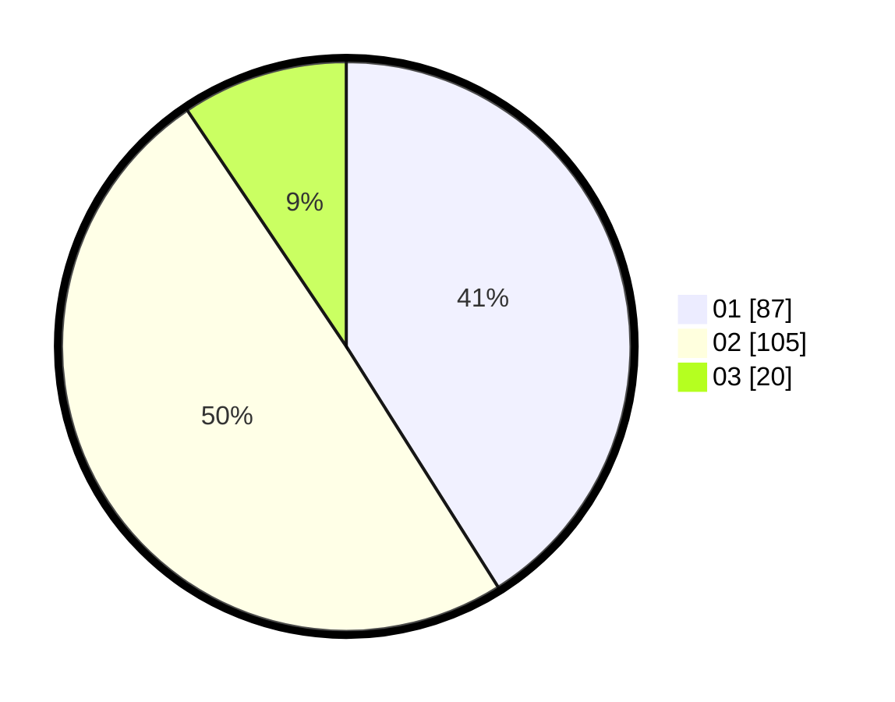

# Hasil

Hasil perolehan suara paslon dapat dilihat pada file paslon-01.txt, paslon-02.txt, dan paslon-03.txt.

Jika tidak ada, artinya data tersebut belum ada pada SIREKAP.

## Perolehan Suara

 * Paslon 01: **87**.
 * Paslon 02: **105**.
 * Paslon 03: **20**.

## Foto C Plano

https://sirekap-obj-formc.kpu.go.id/579e/pemilu/ppwp/31/74/04/10/01/3174041001017-20240216-085530--3265b7d7-1f07-47e3-a36a-50bcb78e4e5d.jpg

https://sirekap-obj-formc.kpu.go.id/579e/pemilu/ppwp/31/74/04/10/01/3174041001017-20240216-085531--0f0e7f60-8a9f-4778-8d99-3e14f4df82fd.jpg

https://sirekap-obj-formc.kpu.go.id/579e/pemilu/ppwp/31/74/04/10/01/3174041001017-20240216-085530--27a01846-a30e-4a81-9125-54281b2c154e.jpg

## DATA PEMILIH TETAP

Jumlah pemilih dalam DPT: **297**.
 * L: **151**.
 * P: **146**.

## DATA PENGGUNA HAK PILIH

Jumlah pengguna hak pilih dalam DPT: **213**.
 * L: **106**.
 * P: **107**.

Jumlah pengguna hak pilih dalam DPTb: **0**.
 * L: **0**.
 * P: **0**.

Jumlah pengguna hak pilih dalam DPK: **1**.
 * L: **1**.
 * P: **0**.

Jumlah pengguna hak pilih: **214**.
 * L: **107**.
 * P: **107**.

## JUMLAH SUARA SAH DAN TIDAK SAH

JUMLAH SELURUH SUARA SAH: **212**.

JUMLAH SUARA TIDAK SAH: **2**.

JUMLAH SELURUH SUARA SAH DAN SUARA TIDAK SAH: **214**.
