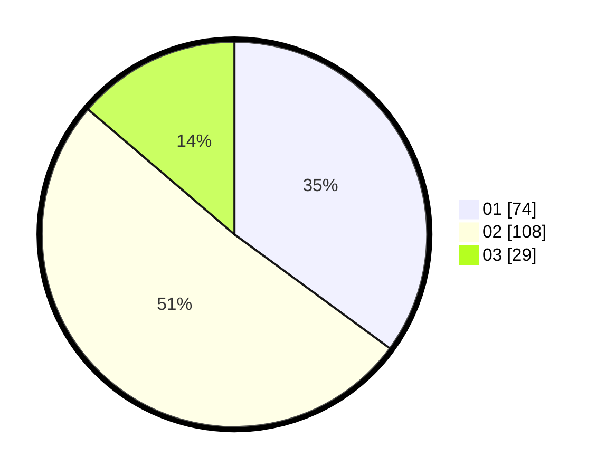

# Hasil

Hasil perolehan suara paslon dapat dilihat pada file paslon-01.txt, paslon-02.txt, dan paslon-03.txt.

Jika tidak ada, artinya data tersebut belum ada pada SIREKAP.

## Perolehan Suara

 * Paslon 01: **74**.
 * Paslon 02: **108**.
 * Paslon 03: **29**.

## Foto C Plano

https://sirekap-obj-formc.kpu.go.id/196d/pemilu/ppwp/31/74/04/10/01/3174041001034-20240216-141600--504db922-020b-4e53-999c-2b696cae0d25.jpg

https://sirekap-obj-formc.kpu.go.id/196d/pemilu/ppwp/31/74/04/10/01/3174041001034-20240214-193450--a17babc1-caf5-49bf-9624-0924d7276d1f.jpg

https://sirekap-obj-formc.kpu.go.id/196d/pemilu/ppwp/31/74/04/10/01/3174041001034-20240214-155719--fbe0ef23-4dde-4637-9fcf-ad524df3ff00.jpg

## DATA PEMILIH TETAP

Jumlah pemilih dalam DPT: **281**.
 * L: **141**.
 * P: **140**.

## DATA PENGGUNA HAK PILIH

Jumlah pengguna hak pilih dalam DPT: **211**.
 * L: **103**.
 * P: **108**.

Jumlah pengguna hak pilih dalam DPTb: **4**.
 * L: **3**.
 * P: **1**.

Jumlah pengguna hak pilih dalam DPK: **0**.
 * L: **0**.
 * P: **0**.

Jumlah pengguna hak pilih: **215**.
 * L: **106**.
 * P: **109**.

## JUMLAH SUARA SAH DAN TIDAK SAH

JUMLAH SELURUH SUARA SAH: **211**.

JUMLAH SUARA TIDAK SAH: **4**.

JUMLAH SELURUH SUARA SAH DAN SUARA TIDAK SAH: **215**.
