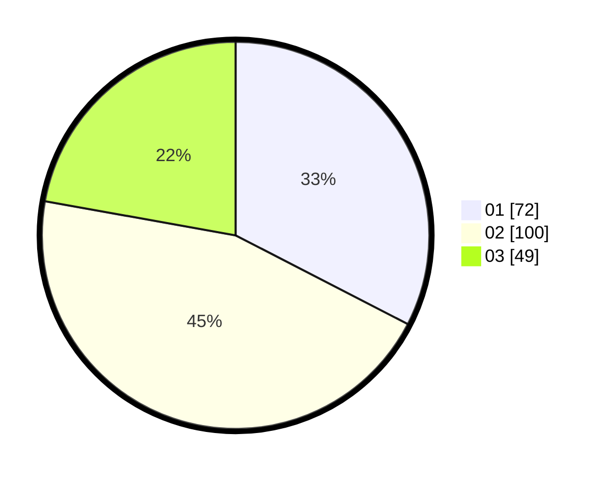

# Hasil

Hasil perolehan suara paslon dapat dilihat pada file paslon-01.txt, paslon-02.txt, dan paslon-03.txt.

Jika tidak ada, artinya data tersebut belum ada pada SIREKAP.

## Perolehan Suara

 * Paslon 01: **72**.
 * Paslon 02: **100**.
 * Paslon 03: **49**.

## Foto C Plano

https://sirekap-obj-formc.kpu.go.id/79ed/pemilu/ppwp/31/74/04/10/01/3174041001035-20240214-155043--fcc4adf9-6644-4f21-8533-39ab05021ef4.jpg

https://sirekap-obj-formc.kpu.go.id/79ed/pemilu/ppwp/31/74/04/10/01/3174041001035-20240214-155039--c6c2212f-bde6-42a7-acc8-d95238924122.jpg

https://sirekap-obj-formc.kpu.go.id/79ed/pemilu/ppwp/31/74/04/10/01/3174041001035-20240214-155222--305b4751-1eaa-40be-a61f-8cb71e268cc7.jpg

## DATA PEMILIH TETAP

Jumlah pemilih dalam DPT: **276**.
 * L: **134**.
 * P: **142**.

## DATA PENGGUNA HAK PILIH

Jumlah pengguna hak pilih dalam DPT: **215**.
 * L: **107**.
 * P: **108**.

Jumlah pengguna hak pilih dalam DPTb: **10**.
 * L: **5**.
 * P: **5**.

Jumlah pengguna hak pilih dalam DPK: **0**.
 * L: **0**.
 * P: **0**.

Jumlah pengguna hak pilih: **225**.
 * L: **112**.
 * P: **113**.

## JUMLAH SUARA SAH DAN TIDAK SAH

JUMLAH SELURUH SUARA SAH: **221**.

JUMLAH SUARA TIDAK SAH: **4**.

JUMLAH SELURUH SUARA SAH DAN SUARA TIDAK SAH: **225**.
