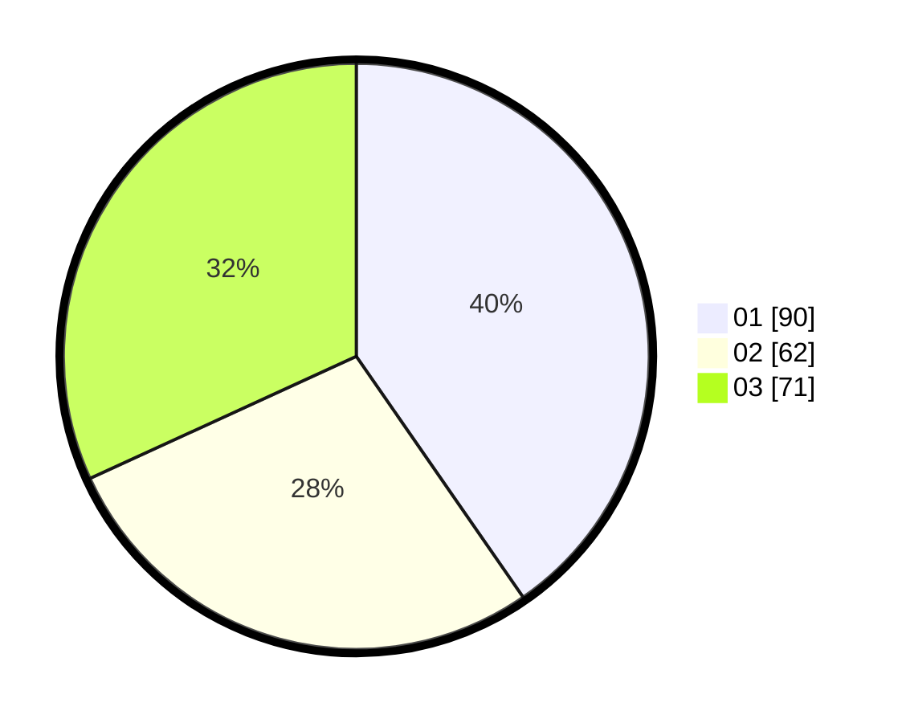

# Hasil

Hasil perolehan suara paslon dapat dilihat pada file paslon-01.txt, paslon-02.txt, dan paslon-03.txt.

Jika tidak ada, artinya data tersebut belum ada pada SIREKAP.

## Perolehan Suara

 * Paslon 01: **90**.
 * Paslon 02: **62**.
 * Paslon 03: **71**.

## Foto C Plano

https://sirekap-obj-formc.kpu.go.id/caca/pemilu/ppwp/31/74/04/10/01/3174041001041-20240214-204820--a329ca05-ca5c-4a6b-ba83-cdc6b2c95406.jpg

https://sirekap-obj-formc.kpu.go.id/caca/pemilu/ppwp/31/74/04/10/01/3174041001041-20240214-204906--4f9c6010-d5ba-4e75-a53b-2718cd987820.jpg
