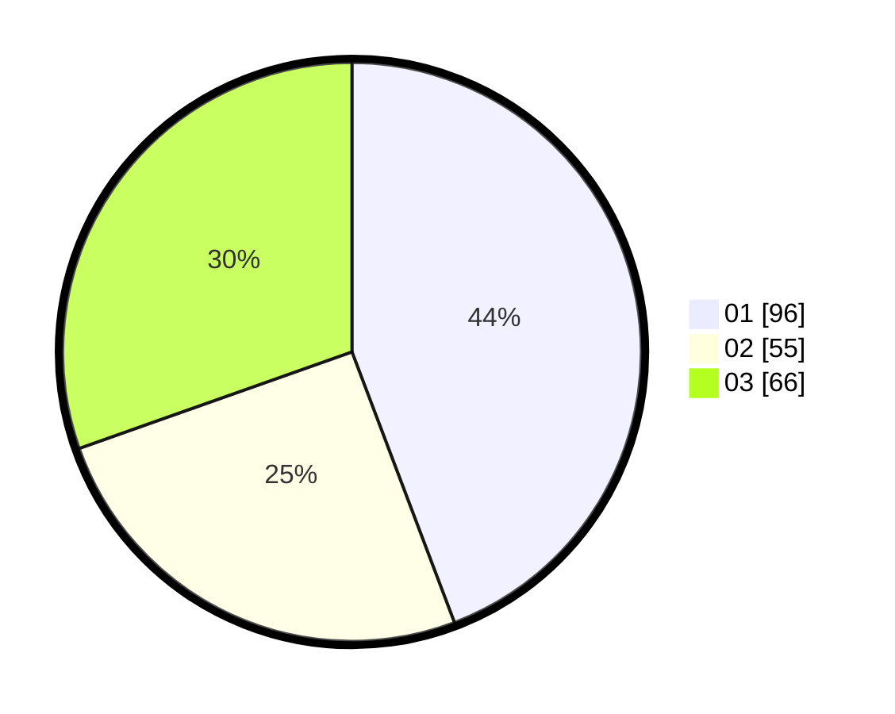

# Hasil

Hasil perolehan suara paslon dapat dilihat pada file paslon-01.txt, paslon-02.txt, dan paslon-03.txt.

Jika tidak ada, artinya data tersebut belum ada pada SIREKAP.

## Perolehan Suara

 * Paslon 01: **96**.
 * Paslon 02: **55**.
 * Paslon 03: **66**.

## Foto C Plano

https://sirekap-obj-formc.kpu.go.id/01c9/pemilu/ppwp/31/74/04/10/01/3174041001043-20240215-032516--6fc944f0-c7f3-4eaf-85cf-02a48e151d22.jpg

https://sirekap-obj-formc.kpu.go.id/01c9/pemilu/ppwp/31/74/04/10/01/3174041001043-20240214-211500--b6488aca-4102-4043-8984-edde07c8beae.jpg

https://sirekap-obj-formc.kpu.go.id/01c9/pemilu/ppwp/31/74/04/10/01/3174041001043-20240214-211549--944e3a08-4512-4a25-be53-7d237548f346.jpg
