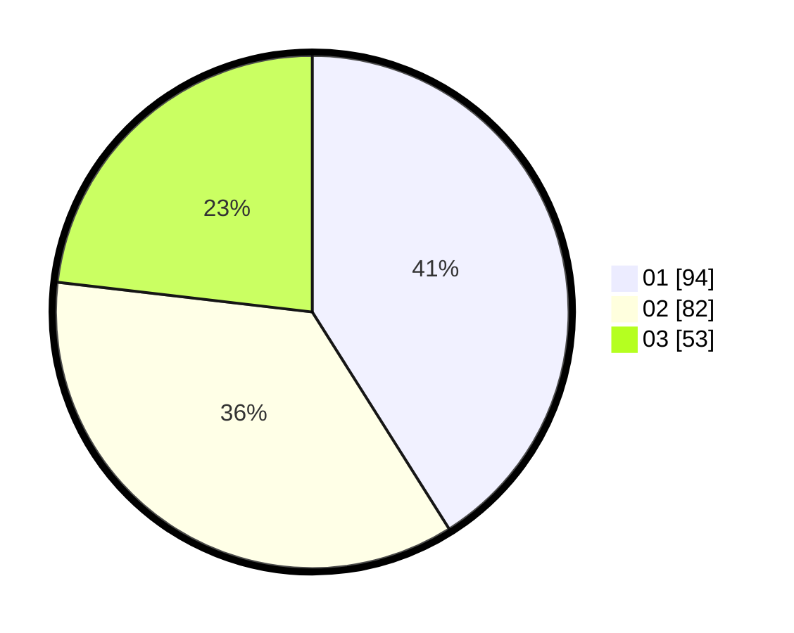

# Hasil

Hasil perolehan suara paslon dapat dilihat pada file paslon-01.txt, paslon-02.txt, dan paslon-03.txt.

Jika tidak ada, artinya data tersebut belum ada pada SIREKAP.

## Perolehan Suara

 * Paslon 01: **94**.
 * Paslon 02: **82**.
 * Paslon 03: **53**.

## Foto C Plano

https://sirekap-obj-formc.kpu.go.id/7916/pemilu/ppwp/31/74/04/10/01/3174041001044-20240215-214805--c9d6d3ff-9824-4cbe-9c15-810b5abd7a38.jpg

https://sirekap-obj-formc.kpu.go.id/7916/pemilu/ppwp/31/74/04/10/01/3174041001044-20240215-214808--0819df25-5422-41ab-8a69-f936ba5c16e0.jpg

https://sirekap-obj-formc.kpu.go.id/7916/pemilu/ppwp/31/74/04/10/01/3174041001044-20240215-214806--ed1e70c1-4a79-416a-92f5-6d3863a062f6.jpg

## DATA PEMILIH TETAP

Jumlah pemilih dalam DPT: **251**.
 * L: **119**.
 * P: **132**.

## DATA PENGGUNA HAK PILIH

Jumlah pengguna hak pilih dalam DPT: **218**.
 * L: **101**.
 * P: **117**.

Jumlah pengguna hak pilih dalam DPTb: **11**.
 * L: **0**.
 * P: **11**.

Jumlah pengguna hak pilih dalam DPK: **3**.
 * L: **2**.
 * P: **1**.

Jumlah pengguna hak pilih: **232**.
 * L: **103**.
 * P: **129**.

## JUMLAH SUARA SAH DAN TIDAK SAH

JUMLAH SELURUH SUARA SAH: **229**.

JUMLAH SUARA TIDAK SAH: **3**.

JUMLAH SELURUH SUARA SAH DAN SUARA TIDAK SAH: **232**.
