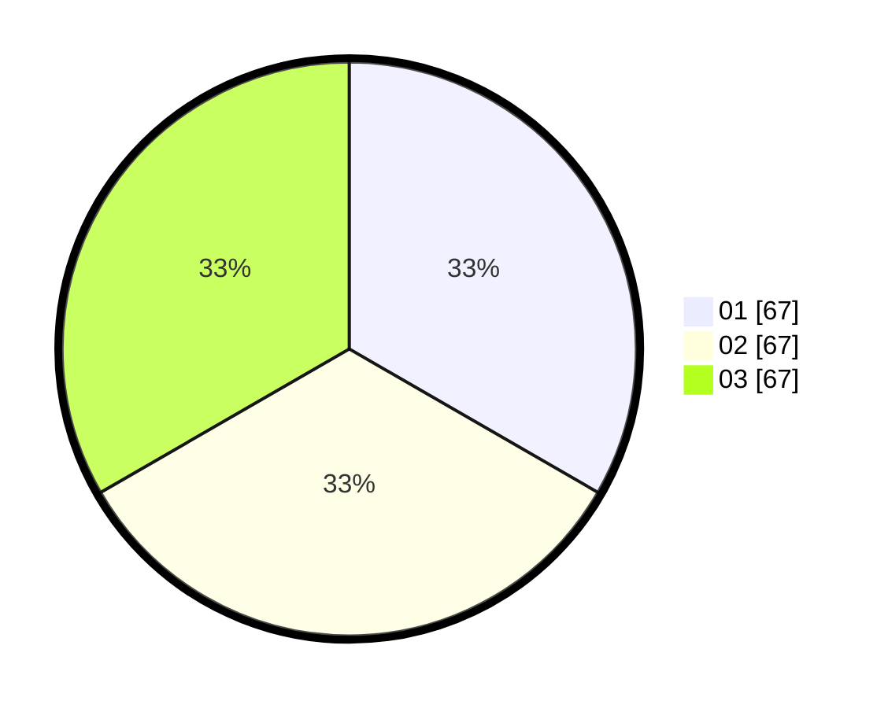

# Hasil

Hasil perolehan suara paslon dapat dilihat pada file paslon-01.txt, paslon-02.txt, dan paslon-03.txt.

Jika tidak ada, artinya data tersebut belum ada pada SIREKAP.

## Perolehan Suara

 * Paslon 01: **67**.
 * Paslon 02: **67**.
 * Paslon 03: **67**.

## Foto C Plano

https://sirekap-obj-formc.kpu.go.id/1bd5/pemilu/ppwp/31/74/04/10/01/3174041001045-20240215-100429--68f690fd-025f-41db-99b3-9312ed58c199.jpg

https://sirekap-obj-formc.kpu.go.id/1bd5/pemilu/ppwp/31/74/04/10/01/3174041001045-20240215-100459--267a4076-9b32-4fe4-90b2-169c386f7ce1.jpg

https://sirekap-obj-formc.kpu.go.id/1bd5/pemilu/ppwp/31/74/04/10/01/3174041001045-20240215-100447--ffc59c1e-084b-4dc8-b2f5-c25d927b86ea.jpg

## DATA PEMILIH TETAP

Jumlah pemilih dalam DPT: **250**.
 * L: **110**.
 * P: **140**.

## DATA PENGGUNA HAK PILIH

Jumlah pengguna hak pilih dalam DPT: **202**.
 * L: **88**.
 * P: **114**.

Jumlah pengguna hak pilih dalam DPTb: **5**.
 * L: **1**.
 * P: **4**.

Jumlah pengguna hak pilih dalam DPK: **0**.
 * L: **0**.
 * P: **0**.

Jumlah pengguna hak pilih: **207**.
 * L: **89**.
 * P: **118**.

## JUMLAH SUARA SAH DAN TIDAK SAH

JUMLAH SELURUH SUARA SAH: **201**.

JUMLAH SUARA TIDAK SAH: **6**.

JUMLAH SELURUH SUARA SAH DAN SUARA TIDAK SAH: **207**.
