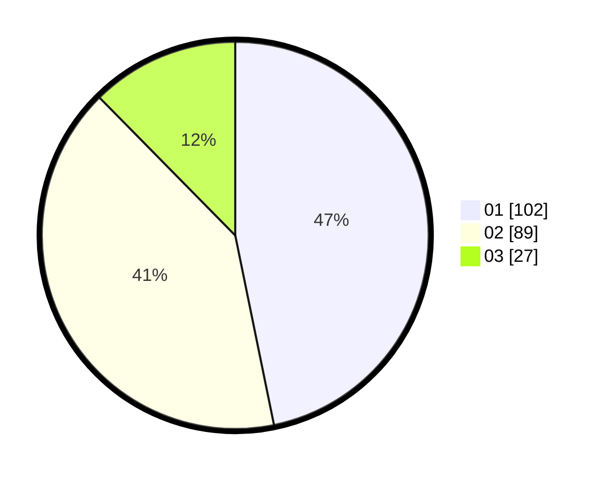

# Hasil

Hasil perolehan suara paslon dapat dilihat pada file paslon-01.txt, paslon-02.txt, dan paslon-03.txt.

Jika tidak ada, artinya data tersebut belum ada pada SIREKAP.

## Perolehan Suara

 * Paslon 01: **102**.
 * Paslon 02: **89**.
 * Paslon 03: **27**.

## Foto C Plano

https://sirekap-obj-formc.kpu.go.id/d06b/pemilu/ppwp/31/74/04/10/01/3174041001047-20240214-205633--b26e2d7e-e26c-40dc-93b8-883365793961.jpg

https://sirekap-obj-formc.kpu.go.id/d06b/pemilu/ppwp/31/74/04/10/01/3174041001047-20240214-220828--41a9b4b3-fcd3-4340-ac7c-2642b21db4e1.jpg
