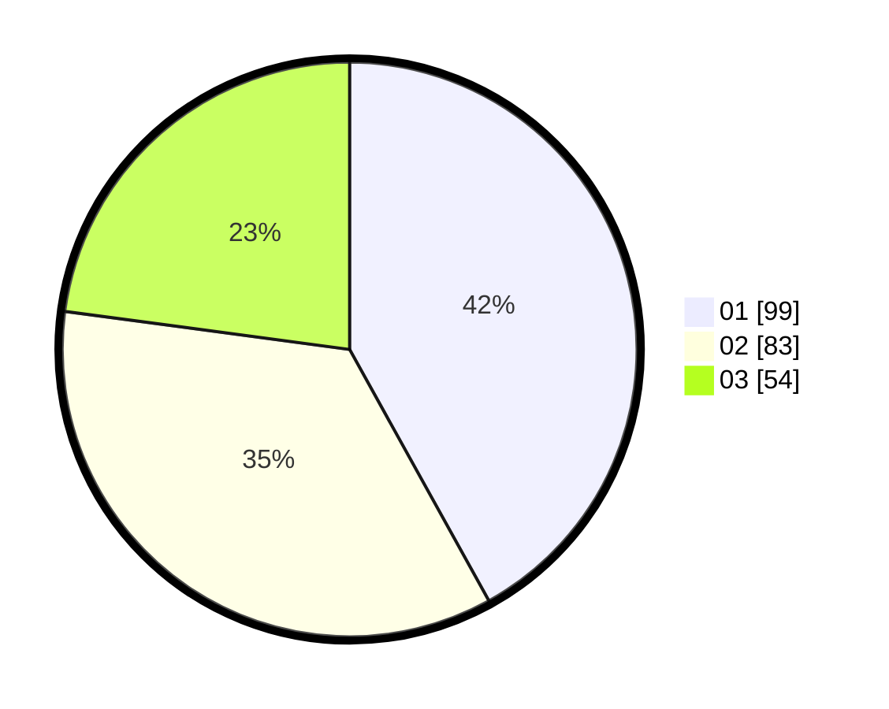

# Hasil

Hasil perolehan suara paslon dapat dilihat pada file paslon-01.txt, paslon-02.txt, dan paslon-03.txt.

Jika tidak ada, artinya data tersebut belum ada pada SIREKAP.

## Perolehan Suara

 * Paslon 01: **99**.
 * Paslon 02: **83**.
 * Paslon 03: **54**.

## Foto C Plano

https://sirekap-obj-formc.kpu.go.id/e729/pemilu/ppwp/31/74/04/10/01/3174041001049-20240216-020837--a8a5d527-be4b-4b4a-9dba-d431700db76d.jpg

https://sirekap-obj-formc.kpu.go.id/e729/pemilu/ppwp/31/74/04/10/01/3174041001049-20240216-020839--9bd352ec-f1d1-486a-afeb-7e821693b0ee.jpg

https://sirekap-obj-formc.kpu.go.id/e729/pemilu/ppwp/31/74/04/10/01/3174041001049-20240216-020838--ec67cab0-eac8-4c86-a941-98199a8d55ab.jpg

## DATA PEMILIH TETAP

Jumlah pemilih dalam DPT: **239**.
 * L: **115**.
 * P: **124**.

## DATA PENGGUNA HAK PILIH

Jumlah pengguna hak pilih dalam DPT: **233**.
 * L: **111**.
 * P: **122**.

Jumlah pengguna hak pilih dalam DPTb: **6**.
 * L: **4**.
 * P: **2**.

Jumlah pengguna hak pilih dalam DPK: **0**.
 * L: **0**.
 * P: **0**.

Jumlah pengguna hak pilih: **239**.
 * L: **115**.
 * P: **124**.

## JUMLAH SUARA SAH DAN TIDAK SAH

JUMLAH SELURUH SUARA SAH: **236**.

JUMLAH SUARA TIDAK SAH: **3**.

JUMLAH SELURUH SUARA SAH DAN SUARA TIDAK SAH: **239**.
