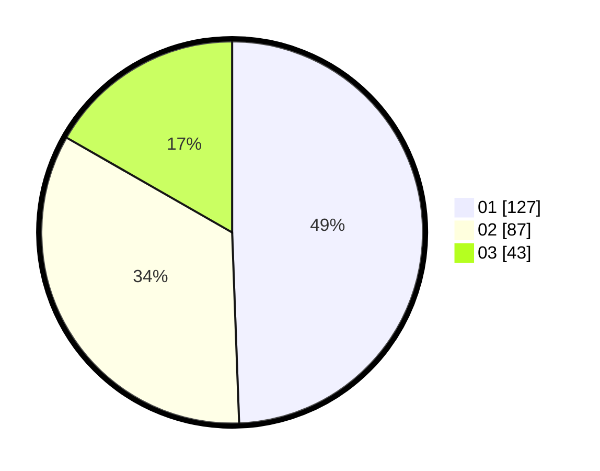

# Hasil

Hasil perolehan suara paslon dapat dilihat pada file paslon-01.txt, paslon-02.txt, dan paslon-03.txt.

Jika tidak ada, artinya data tersebut belum ada pada SIREKAP.

## Perolehan Suara

 * Paslon 01: **127**.
 * Paslon 02: **87**.
 * Paslon 03: **43**.

## Foto C Plano

https://sirekap-obj-formc.kpu.go.id/e561/pemilu/ppwp/31/74/04/10/01/3174041001050-20240216-050221--102534c7-90cf-40af-91d5-cb9992069415.jpg

https://sirekap-obj-formc.kpu.go.id/e561/pemilu/ppwp/31/74/04/10/01/3174041001050-20240216-050223--4e7d203e-5dc4-4f94-a9fd-1f37e06ad09f.jpg

https://sirekap-obj-formc.kpu.go.id/e561/pemilu/ppwp/31/74/04/10/01/3174041001050-20240216-050222--b0527a71-21fb-4946-b548-dae370c78ec5.jpg

## DATA PEMILIH TETAP

Jumlah pemilih dalam DPT: **287**.
 * L: **137**.
 * P: **150**.

## DATA PENGGUNA HAK PILIH

Jumlah pengguna hak pilih dalam DPT: **250**.
 * L: **114**.
 * P: **136**.

Jumlah pengguna hak pilih dalam DPTb: **4**.
 * L: **3**.
 * P: **1**.

Jumlah pengguna hak pilih dalam DPK: **8**.
 * L: **3**.
 * P: **5**.

Jumlah pengguna hak pilih: **262**.
 * L: **120**.
 * P: **142**.

## JUMLAH SUARA SAH DAN TIDAK SAH

JUMLAH SELURUH SUARA SAH: **257**.

JUMLAH SUARA TIDAK SAH: **5**.

JUMLAH SELURUH SUARA SAH DAN SUARA TIDAK SAH: **262**.
