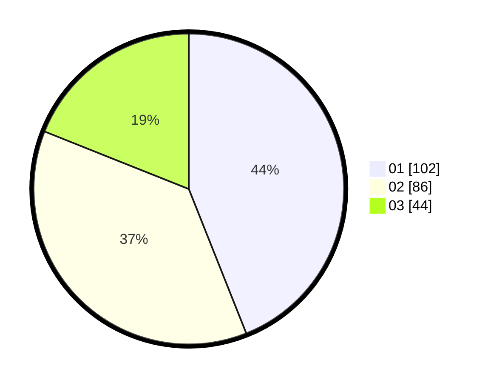

# Hasil

Hasil perolehan suara paslon dapat dilihat pada file paslon-01.txt, paslon-02.txt, dan paslon-03.txt.

Jika tidak ada, artinya data tersebut belum ada pada SIREKAP.

## Perolehan Suara

 * Paslon 01: **102**.
 * Paslon 02: **86**.
 * Paslon 03: **44**.

## Foto C Plano

https://sirekap-obj-formc.kpu.go.id/66d8/pemilu/ppwp/31/74/04/10/01/3174041001052-20240215-205714--40f71bca-3b18-4d95-a1e6-9dde3c8fd54e.jpg

https://sirekap-obj-formc.kpu.go.id/66d8/pemilu/ppwp/31/74/04/10/01/3174041001052-20240215-205716--679a09e6-7b35-4f3e-9e38-65fe4f96f738.jpg

https://sirekap-obj-formc.kpu.go.id/66d8/pemilu/ppwp/31/74/04/10/01/3174041001052-20240215-205715--68745d8a-6f51-4336-a242-bb124aa0f7d8.jpg

## DATA PEMILIH TETAP

Jumlah pemilih dalam DPT: **271**.
 * L: **124**.
 * P: **147**.

## DATA PENGGUNA HAK PILIH

Jumlah pengguna hak pilih dalam DPT: **226**.
 * L: **102**.
 * P: **124**.

Jumlah pengguna hak pilih dalam DPTb: **7**.
 * L: **3**.
 * P: **4**.

Jumlah pengguna hak pilih dalam DPK: **5**.
 * L: **1**.
 * P: **4**.

Jumlah pengguna hak pilih: **238**.
 * L: **106**.
 * P: **132**.

## JUMLAH SUARA SAH DAN TIDAK SAH

JUMLAH SELURUH SUARA SAH: **232**.

JUMLAH SUARA TIDAK SAH: **6**.

JUMLAH SELURUH SUARA SAH DAN SUARA TIDAK SAH: **238**.
