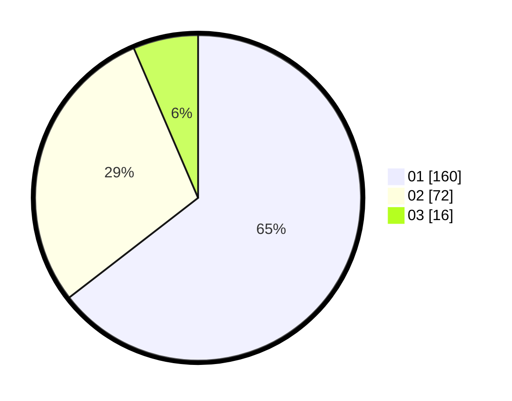

# Hasil

Hasil perolehan suara paslon dapat dilihat pada file paslon-01.txt, paslon-02.txt, dan paslon-03.txt.

Jika tidak ada, artinya data tersebut belum ada pada SIREKAP.

## Perolehan Suara

 * Paslon 01: **160**.
 * Paslon 02: **72**.
 * Paslon 03: **16**.

## Foto C Plano

https://sirekap-obj-formc.kpu.go.id/d000/pemilu/ppwp/31/74/04/10/01/3174041001056-20240214-194924--9db52936-0874-425e-a4da-b6a2c0f79885.jpg

https://sirekap-obj-formc.kpu.go.id/d000/pemilu/ppwp/31/74/04/10/01/3174041001056-20240214-195113--4cf43e3d-dbd2-44f6-9181-bfbd7cfa612e.jpg

https://sirekap-obj-formc.kpu.go.id/d000/pemilu/ppwp/31/74/04/10/01/3174041001056-20240214-192925--2dda328e-69f9-40fb-915a-b88d329aaaea.jpg

## DATA PEMILIH TETAP

Jumlah pemilih dalam DPT: **281**.
 * L: **139**.
 * P: **142**.

## DATA PENGGUNA HAK PILIH

Jumlah pengguna hak pilih dalam DPT: **245**.
 * L: **117**.
 * P: **128**.

Jumlah pengguna hak pilih dalam DPTb: **2**.
 * L: **1**.
 * P: **1**.

Jumlah pengguna hak pilih dalam DPK: **3**.
 * L: **1**.
 * P: **2**.

Jumlah pengguna hak pilih: **250**.
 * L: **119**.
 * P: **131**.

## JUMLAH SUARA SAH DAN TIDAK SAH

JUMLAH SELURUH SUARA SAH: **248**.

JUMLAH SUARA TIDAK SAH: **2**.

JUMLAH SELURUH SUARA SAH DAN SUARA TIDAK SAH: **250**.
