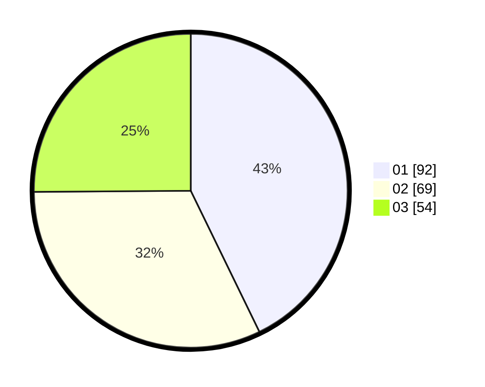

# Hasil

Hasil perolehan suara paslon dapat dilihat pada file paslon-01.txt, paslon-02.txt, dan paslon-03.txt.

Jika tidak ada, artinya data tersebut belum ada pada SIREKAP.

## Perolehan Suara

 * Paslon 01: **92**.
 * Paslon 02: **69**.
 * Paslon 03: **54**.

## Foto C Plano

https://sirekap-obj-formc.kpu.go.id/c9ca/pemilu/ppwp/31/74/04/10/01/3174041001067-20240217-222154--25cf96ed-9f96-45f1-841d-9fdd18381544.jpg

https://sirekap-obj-formc.kpu.go.id/c9ca/pemilu/ppwp/31/74/04/10/01/3174041001067-20240217-222156--8c16ed79-30d9-4a4f-8eca-36bb80236ca0.jpg

https://sirekap-obj-formc.kpu.go.id/c9ca/pemilu/ppwp/31/74/04/10/01/3174041001067-20240217-222155--e8485c00-4a4e-44e0-ae69-a660c2d8b6e5.jpg

## DATA PEMILIH TETAP

Jumlah pemilih dalam DPT: **262**.
 * L: **131**.
 * P: **131**.

## DATA PENGGUNA HAK PILIH

Jumlah pengguna hak pilih dalam DPT: **206**.
 * L: **96**.
 * P: **110**.

Jumlah pengguna hak pilih dalam DPTb: **10**.
 * L: **3**.
 * P: **7**.

Jumlah pengguna hak pilih dalam DPK: **3**.
 * L: **1**.
 * P: **2**.

Jumlah pengguna hak pilih: **219**.
 * L: **100**.
 * P: **119**.

## JUMLAH SUARA SAH DAN TIDAK SAH

JUMLAH SELURUH SUARA SAH: **215**.

JUMLAH SUARA TIDAK SAH: **4**.

JUMLAH SELURUH SUARA SAH DAN SUARA TIDAK SAH: **219**.
