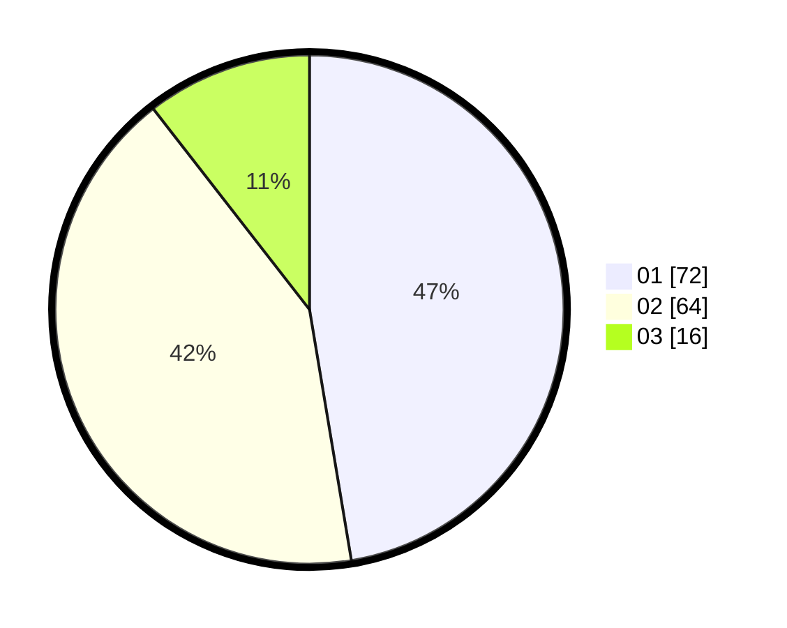

# Hasil

Hasil perolehan suara paslon dapat dilihat pada file paslon-01.txt, paslon-02.txt, dan paslon-03.txt.

Jika tidak ada, artinya data tersebut belum ada pada SIREKAP.

## Perolehan Suara

 * Paslon 01: **72**.
 * Paslon 02: **64**.
 * Paslon 03: **16**.

## Foto C Plano

https://sirekap-obj-formc.kpu.go.id/832a/pemilu/ppwp/31/74/04/10/01/3174041001070-20240214-155214--e049a157-a984-4948-90b1-9def08a303ab.jpg

https://sirekap-obj-formc.kpu.go.id/832a/pemilu/ppwp/31/74/04/10/01/3174041001070-20240214-155219--db364642-5ec1-4e58-899c-970066d32980.jpg

https://sirekap-obj-formc.kpu.go.id/832a/pemilu/ppwp/31/74/04/10/01/3174041001070-20240214-155225--3e8a4200-4813-4c8a-96a9-f3d5db008ddd.jpg

## DATA PEMILIH TETAP

Jumlah pemilih dalam DPT: **270**.
 * L: **155**.
 * P: **115**.

## DATA PENGGUNA HAK PILIH

Jumlah pengguna hak pilih dalam DPT: **149**.
 * L: **77**.
 * P: **72**.

Jumlah pengguna hak pilih dalam DPTb: **2**.
 * L: **1**.
 * P: **1**.

Jumlah pengguna hak pilih dalam DPK: **2**.
 * L: **0**.
 * P: **2**.

Jumlah pengguna hak pilih: **153**.
 * L: **78**.
 * P: **75**.

## JUMLAH SUARA SAH DAN TIDAK SAH

JUMLAH SELURUH SUARA SAH: **152**.

JUMLAH SUARA TIDAK SAH: **1**.

JUMLAH SELURUH SUARA SAH DAN SUARA TIDAK SAH: **153**.
