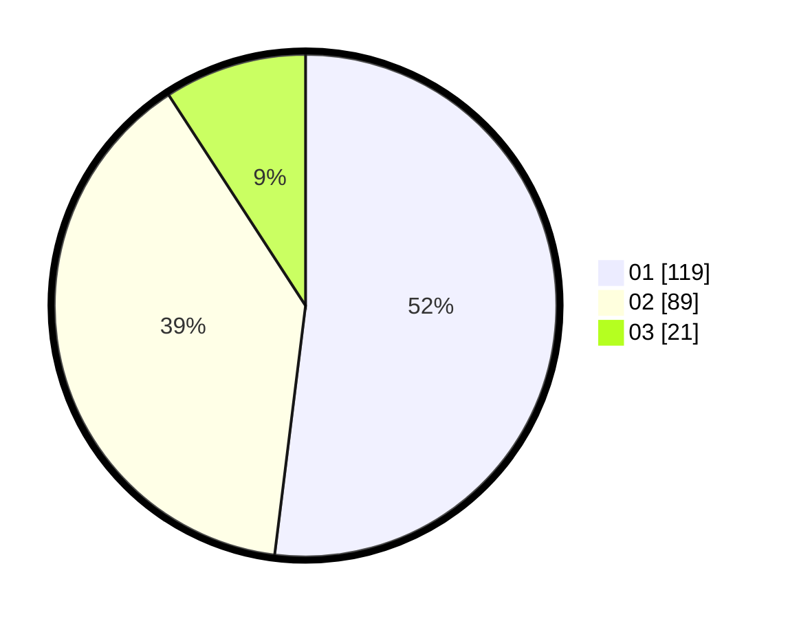

# Hasil

Hasil perolehan suara paslon dapat dilihat pada file paslon-01.txt, paslon-02.txt, dan paslon-03.txt.

Jika tidak ada, artinya data tersebut belum ada pada SIREKAP.

## Perolehan Suara

 * Paslon 01: **119**.
 * Paslon 02: **89**.
 * Paslon 03: **21**.

## Foto C Plano

https://sirekap-obj-formc.kpu.go.id/124e/pemilu/ppwp/31/74/04/10/01/3174041001072-20240215-021330--8bd36d9b-4e3a-42e0-9741-50c95b0af9a2.jpg

https://sirekap-obj-formc.kpu.go.id/124e/pemilu/ppwp/31/74/04/10/01/3174041001072-20240214-203045--81b95122-4eae-462a-afc8-7672444f4fb6.jpg

https://sirekap-obj-formc.kpu.go.id/124e/pemilu/ppwp/31/74/04/10/01/3174041001072-20240214-194333--b88d87f5-9c52-45a2-aed3-f6a764f8df3c.jpg
