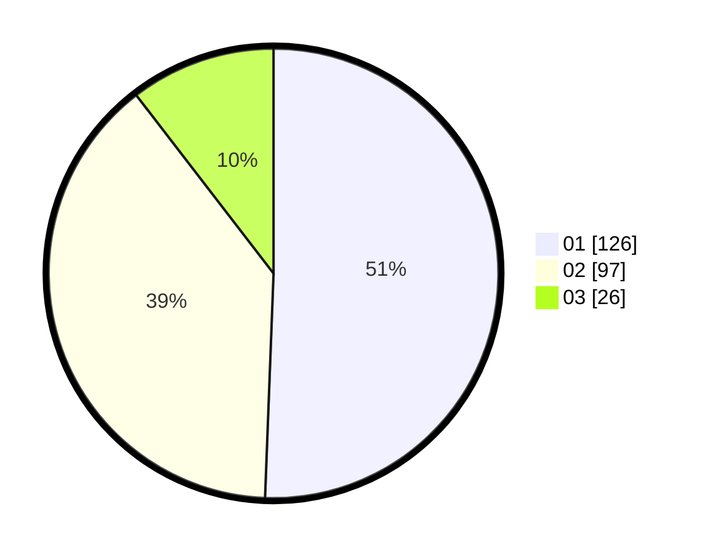

# Hasil

Hasil perolehan suara paslon dapat dilihat pada file paslon-01.txt, paslon-02.txt, dan paslon-03.txt.

Jika tidak ada, artinya data tersebut belum ada pada SIREKAP.

## Perolehan Suara

 * Paslon 01: **126**.
 * Paslon 02: **97**.
 * Paslon 03: **26**.

## Foto C Plano

https://sirekap-obj-formc.kpu.go.id/9b81/pemilu/ppwp/31/74/04/10/01/3174041001074-20240214-160124--0c2e55dc-5112-4bd2-93a6-92eb7f570764.jpg

https://sirekap-obj-formc.kpu.go.id/9b81/pemilu/ppwp/31/74/04/10/01/3174041001074-20240214-160054--ce280fea-2faf-4cf6-837c-68355ba49ce1.jpg

https://sirekap-obj-formc.kpu.go.id/9b81/pemilu/ppwp/31/74/04/10/01/3174041001074-20240214-184706--ba39e636-acd3-42af-991c-2c438e26115f.jpg

## DATA PEMILIH TETAP

Jumlah pemilih dalam DPT: **265**.
 * L: **130**.
 * P: **135**.

## DATA PENGGUNA HAK PILIH

Jumlah pengguna hak pilih dalam DPT: **239**.
 * L: **117**.
 * P: **122**.

Jumlah pengguna hak pilih dalam DPTb: **5**.
 * L: **2**.
 * P: **3**.

Jumlah pengguna hak pilih dalam DPK: **7**.
 * L: **2**.
 * P: **5**.

Jumlah pengguna hak pilih: **251**.
 * L: **121**.
 * P: **130**.

## JUMLAH SUARA SAH DAN TIDAK SAH

JUMLAH SELURUH SUARA SAH: **249**.

JUMLAH SUARA TIDAK SAH: **2**.

JUMLAH SELURUH SUARA SAH DAN SUARA TIDAK SAH: **251**.
