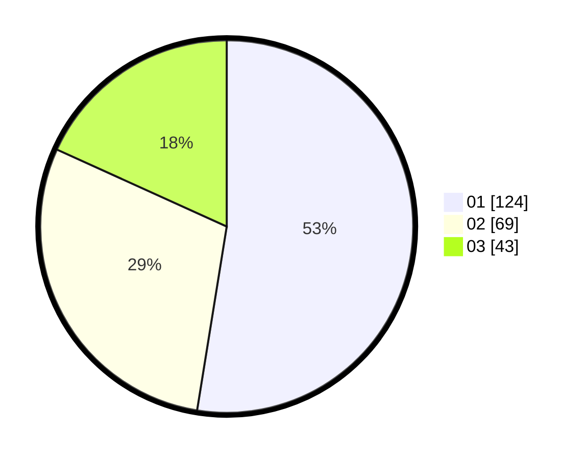

# Hasil

Hasil perolehan suara paslon dapat dilihat pada file paslon-01.txt, paslon-02.txt, dan paslon-03.txt.

Jika tidak ada, artinya data tersebut belum ada pada SIREKAP.

## Perolehan Suara

 * Paslon 01: **124**.
 * Paslon 02: **69**.
 * Paslon 03: **43**.

## Foto C Plano

https://sirekap-obj-formc.kpu.go.id/6bea/pemilu/ppwp/31/74/04/10/01/3174041001078-20240216-010736--de6d7fdf-fb73-4b59-b2a3-e98d8baf4bf2.jpg

https://sirekap-obj-formc.kpu.go.id/6bea/pemilu/ppwp/31/74/04/10/01/3174041001078-20240216-010737--f2356dae-ee7f-4510-9014-28e43909748f.jpg

https://sirekap-obj-formc.kpu.go.id/6bea/pemilu/ppwp/31/74/04/10/01/3174041001078-20240216-010736--71473e0e-4395-420b-9f12-6edccfec1a8d.jpg

## DATA PEMILIH TETAP

Jumlah pemilih dalam DPT: **265**.
 * L: **130**.
 * P: **135**.

## DATA PENGGUNA HAK PILIH

Jumlah pengguna hak pilih dalam DPT: **221**.
 * L: **104**.
 * P: **117**.

Jumlah pengguna hak pilih dalam DPTb: **7**.
 * L: **3**.
 * P: **4**.

Jumlah pengguna hak pilih dalam DPK: **11**.
 * L: **5**.
 * P: **6**.

Jumlah pengguna hak pilih: **239**.
 * L: **112**.
 * P: **127**.

## JUMLAH SUARA SAH DAN TIDAK SAH

JUMLAH SELURUH SUARA SAH: **236**.

JUMLAH SUARA TIDAK SAH: **3**.

JUMLAH SELURUH SUARA SAH DAN SUARA TIDAK SAH: **239**.
