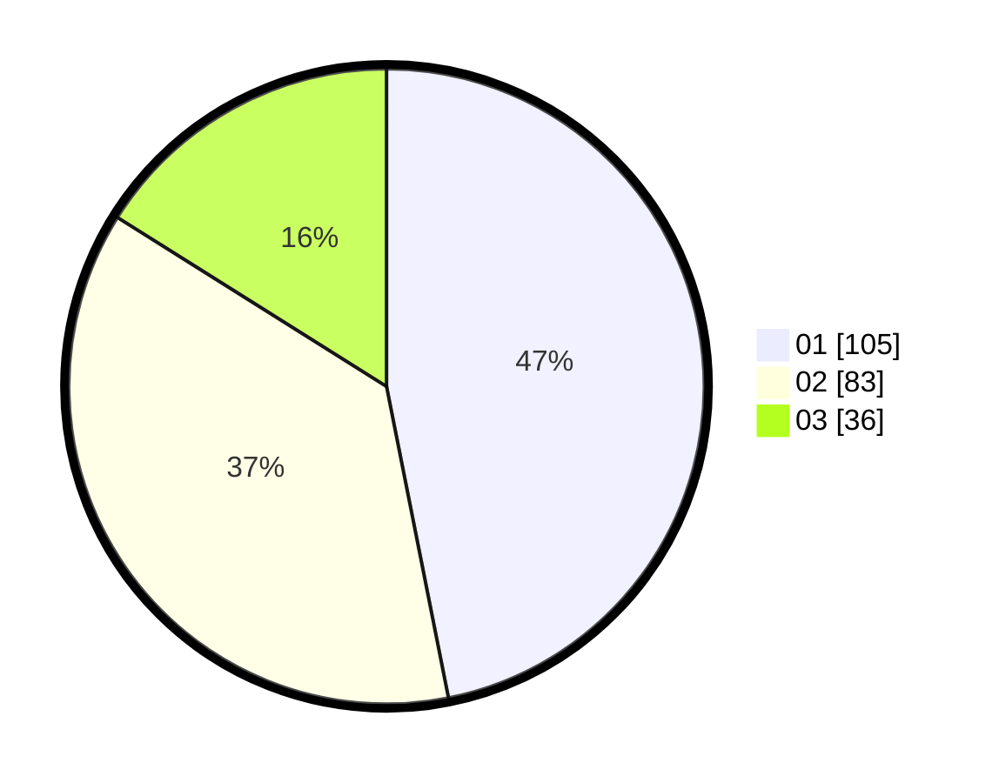

# Hasil

Hasil perolehan suara paslon dapat dilihat pada file paslon-01.txt, paslon-02.txt, dan paslon-03.txt.

Jika tidak ada, artinya data tersebut belum ada pada SIREKAP.

## Perolehan Suara

 * Paslon 01: **105**.
 * Paslon 02: **83**.
 * Paslon 03: **36**.

## Foto C Plano

https://sirekap-obj-formc.kpu.go.id/baf0/pemilu/ppwp/31/74/04/10/01/3174041001079-20240215-224734--917e1e7c-d13a-409f-ba58-cc7d12e7cbf4.jpg

https://sirekap-obj-formc.kpu.go.id/baf0/pemilu/ppwp/31/74/04/10/01/3174041001079-20240215-224739--af854d9c-04c2-4c83-9763-8621115d1672.jpg

https://sirekap-obj-formc.kpu.go.id/baf0/pemilu/ppwp/31/74/04/10/01/3174041001079-20240215-224736--8e065fd3-792f-41cc-86b7-cd9da3f270a6.jpg

## DATA PEMILIH TETAP

Jumlah pemilih dalam DPT: **256**.
 * L: **128**.
 * P: **128**.

## DATA PENGGUNA HAK PILIH

Jumlah pengguna hak pilih dalam DPT: **214**.
 * L: **104**.
 * P: **110**.

Jumlah pengguna hak pilih dalam DPTb: **11**.
 * L: **6**.
 * P: **5**.

Jumlah pengguna hak pilih dalam DPK: **3**.
 * L: **2**.
 * P: **1**.

Jumlah pengguna hak pilih: **228**.
 * L: **112**.
 * P: **116**.

## JUMLAH SUARA SAH DAN TIDAK SAH

JUMLAH SELURUH SUARA SAH: **224**.

JUMLAH SUARA TIDAK SAH: **4**.

JUMLAH SELURUH SUARA SAH DAN SUARA TIDAK SAH: **228**.
