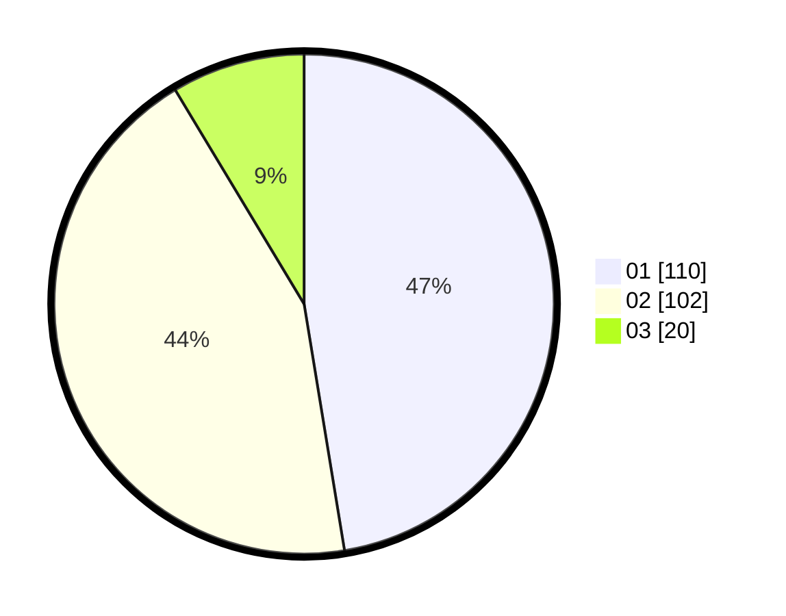

# Hasil

Hasil perolehan suara paslon dapat dilihat pada file paslon-01.txt, paslon-02.txt, dan paslon-03.txt.

Jika tidak ada, artinya data tersebut belum ada pada SIREKAP.

## Perolehan Suara

 * Paslon 01: **110**.
 * Paslon 02: **102**.
 * Paslon 03: **20**.

## Foto C Plano

https://sirekap-obj-formc.kpu.go.id/5b3a/pemilu/ppwp/31/74/04/10/01/3174041001082-20240214-202244--647a4a79-5793-434c-8a27-e4fb3e5dc8cb.jpg

https://sirekap-obj-formc.kpu.go.id/5b3a/pemilu/ppwp/31/74/04/10/01/3174041001082-20240214-202417--763f004b-6159-4318-a126-ac981deb5926.jpg

https://sirekap-obj-formc.kpu.go.id/5b3a/pemilu/ppwp/31/74/04/10/01/3174041001082-20240214-202614--dbad8a5d-85ef-49c8-b330-3a3ce4b67f18.jpg

## DATA PEMILIH TETAP

Jumlah pemilih dalam DPT: **269**.
 * L: **128**.
 * P: **141**.

## DATA PENGGUNA HAK PILIH

Jumlah pengguna hak pilih dalam DPT: **228**.
 * L: **103**.
 * P: **125**.

Jumlah pengguna hak pilih dalam DPTb: **5**.
 * L: **4**.
 * P: **1**.

Jumlah pengguna hak pilih dalam DPK: **2**.
 * L: **0**.
 * P: **2**.

Jumlah pengguna hak pilih: **235**.
 * L: **107**.
 * P: **128**.

## JUMLAH SUARA SAH DAN TIDAK SAH

JUMLAH SELURUH SUARA SAH: **232**.

JUMLAH SUARA TIDAK SAH: **3**.

JUMLAH SELURUH SUARA SAH DAN SUARA TIDAK SAH: **235**.
