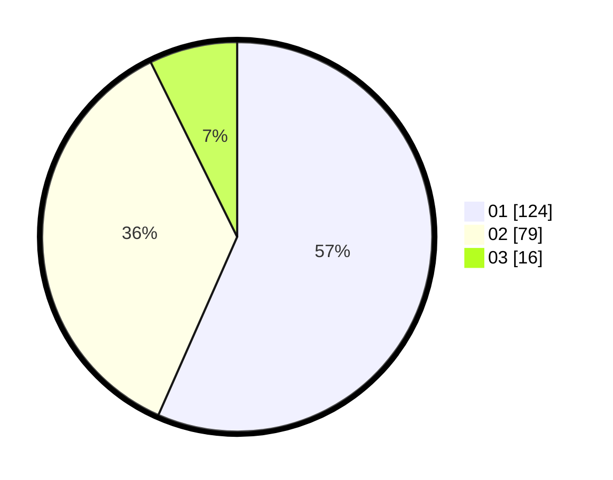

# Hasil

Hasil perolehan suara paslon dapat dilihat pada file paslon-01.txt, paslon-02.txt, dan paslon-03.txt.

Jika tidak ada, artinya data tersebut belum ada pada SIREKAP.

## Perolehan Suara

 * Paslon 01: **124**.
 * Paslon 02: **79**.
 * Paslon 03: **16**.

## Foto C Plano

https://sirekap-obj-formc.kpu.go.id/1d52/pemilu/ppwp/31/74/04/10/01/3174041001084-20240216-083312--35595d03-b5e3-4d11-b9bb-16ea83b354b7.jpg

https://sirekap-obj-formc.kpu.go.id/1d52/pemilu/ppwp/31/74/04/10/01/3174041001084-20240214-223501--470282f7-2d91-4f81-9eb6-373e95062e42.jpg

https://sirekap-obj-formc.kpu.go.id/1d52/pemilu/ppwp/31/74/04/10/01/3174041001084-20240214-223616--0cde35ce-d573-43ec-999a-a5e0e60eeaf9.jpg

## DATA PEMILIH TETAP

Jumlah pemilih dalam DPT: **276**.
 * L: **141**.
 * P: **135**.

## DATA PENGGUNA HAK PILIH

Jumlah pengguna hak pilih dalam DPT: **219**.
 * L: **110**.
 * P: **109**.

Jumlah pengguna hak pilih dalam DPTb: **0**.
 * L: **0**.
 * P: **0**.

Jumlah pengguna hak pilih dalam DPK: **2**.
 * L: **2**.
 * P: **0**.

Jumlah pengguna hak pilih: **221**.
 * L: **112**.
 * P: **109**.

## JUMLAH SUARA SAH DAN TIDAK SAH

JUMLAH SELURUH SUARA SAH: **219**.

JUMLAH SUARA TIDAK SAH: **2**.

JUMLAH SELURUH SUARA SAH DAN SUARA TIDAK SAH: **221**.
