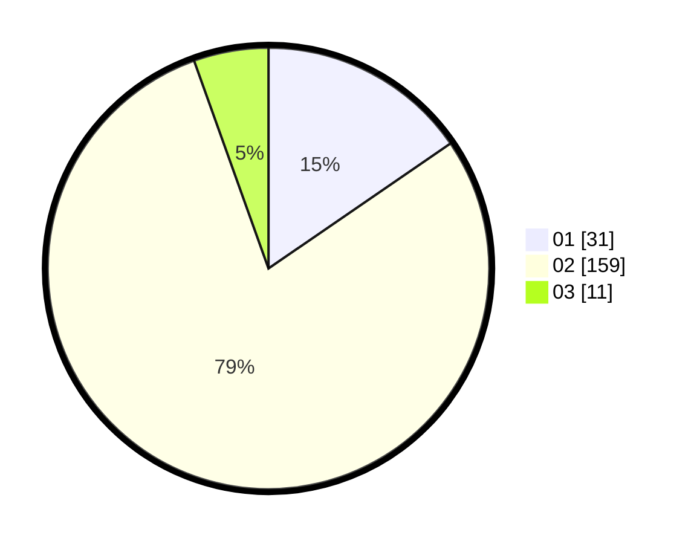

# Hasil

Hasil perolehan suara paslon dapat dilihat pada file paslon-01.txt, paslon-02.txt, dan paslon-03.txt.

Jika tidak ada, artinya data tersebut belum ada pada SIREKAP.

## Perolehan Suara

 * Paslon 01: **31**.
 * Paslon 02: **159**.
 * Paslon 03: **11**.

## Foto C Plano

https://sirekap-obj-formc.kpu.go.id/1cb2/pemilu/ppwp/31/74/04/10/01/3174041001902-20240214-192124--e6343a71-8df8-4f3f-b63c-d6cf18361943.jpg

https://sirekap-obj-formc.kpu.go.id/1cb2/pemilu/ppwp/31/74/04/10/01/3174041001902-20240214-192216--694d1914-ce96-4633-918e-70c0020362be.jpg

https://sirekap-obj-formc.kpu.go.id/1cb2/pemilu/ppwp/31/74/04/10/01/3174041001902-20240214-194032--1cc373fb-5862-4787-94e0-f8fcadacda26.jpg

## DATA PEMILIH TETAP

Jumlah pemilih dalam DPT: **222**.
 * L: **376**.
 * P: **306**.

## DATA PENGGUNA HAK PILIH

Jumlah pengguna hak pilih dalam DPT: **202**.
 * L: **707**.
 * P: **700**.

Jumlah pengguna hak pilih dalam DPTb: **0**.
 * L: **0**.
 * P: **0**.

Jumlah pengguna hak pilih dalam DPK: **2**.
 * L: **0**.
 * P: **7**.

Jumlah pengguna hak pilih: **202**.
 * L: **402**.
 * P: **700**.

## JUMLAH SUARA SAH DAN TIDAK SAH

JUMLAH SELURUH SUARA SAH: **201**.

JUMLAH SUARA TIDAK SAH: **1**.

JUMLAH SELURUH SUARA SAH DAN SUARA TIDAK SAH: **202**.
