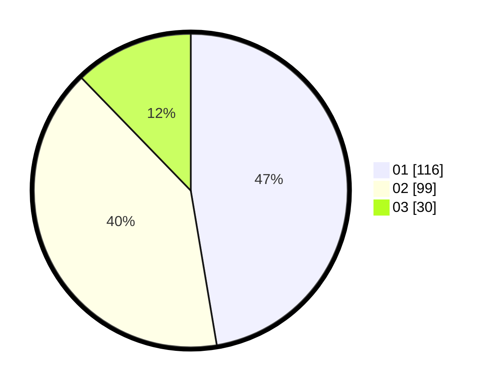

# Hasil

Hasil perolehan suara paslon dapat dilihat pada file paslon-01.txt, paslon-02.txt, dan paslon-03.txt.

Jika tidak ada, artinya data tersebut belum ada pada SIREKAP.

## Perolehan Suara

 * Paslon 01: **116**.
 * Paslon 02: **99**.
 * Paslon 03: **30**.

## Foto C Plano

https://sirekap-obj-formc.kpu.go.id/1b77/pemilu/ppwp/31/74/04/10/02/3174041002007-20240215-011019--791bb39f-78ec-401e-882a-c290d3fcd5a9.jpg

https://sirekap-obj-formc.kpu.go.id/1b77/pemilu/ppwp/31/74/04/10/02/3174041002007-20240215-011025--0f8446ee-1e71-4d42-9b73-4a74c77f880a.jpg

https://sirekap-obj-formc.kpu.go.id/1b77/pemilu/ppwp/31/74/04/10/02/3174041002007-20240215-011029--3a4b0d8f-988b-488e-80a4-de19d338a1bd.jpg

## DATA PEMILIH TETAP

Jumlah pemilih dalam DPT: **268**.
 * L: **125**.
 * P: **143**.

## DATA PENGGUNA HAK PILIH

Jumlah pengguna hak pilih dalam DPT: **234**.
 * L: **107**.
 * P: **127**.

Jumlah pengguna hak pilih dalam DPTb: **14**.
 * L: **2**.
 * P: **12**.

Jumlah pengguna hak pilih dalam DPK: **1**.
 * L: **1**.
 * P: **0**.

Jumlah pengguna hak pilih: **249**.
 * L: **110**.
 * P: **139**.

## JUMLAH SUARA SAH DAN TIDAK SAH

JUMLAH SELURUH SUARA SAH: **245**.

JUMLAH SUARA TIDAK SAH: **4**.

JUMLAH SELURUH SUARA SAH DAN SUARA TIDAK SAH: **249**.
