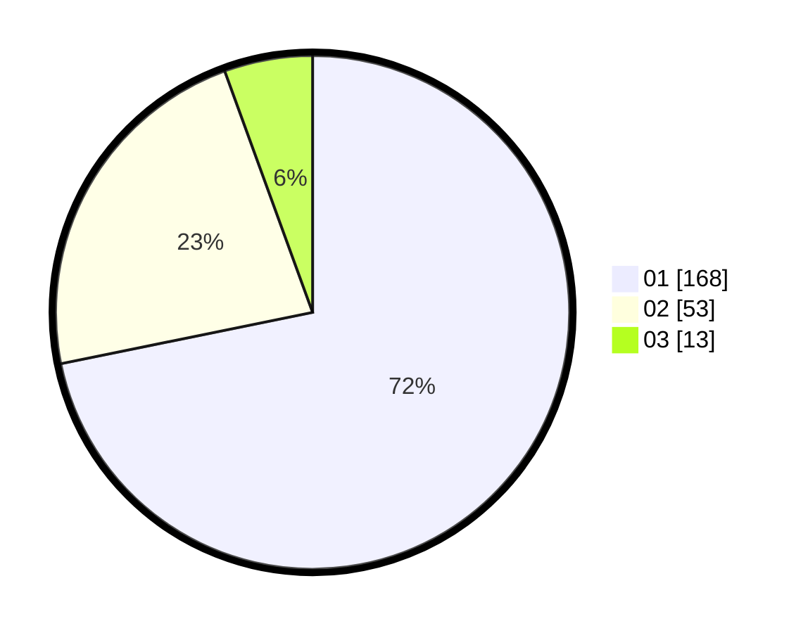

# Hasil

Hasil perolehan suara paslon dapat dilihat pada file paslon-01.txt, paslon-02.txt, dan paslon-03.txt.

Jika tidak ada, artinya data tersebut belum ada pada SIREKAP.

## Perolehan Suara

 * Paslon 01: **168**.
 * Paslon 02: **53**.
 * Paslon 03: **13**.

## Foto C Plano

https://sirekap-obj-formc.kpu.go.id/c52c/pemilu/ppwp/31/74/04/10/02/3174041002021-20240216-094421--ac440171-3a8c-46e3-b1fd-b9fb1bee083b.jpg

https://sirekap-obj-formc.kpu.go.id/c52c/pemilu/ppwp/31/74/04/10/02/3174041002021-20240216-094425--580144e7-fae7-4777-8ac5-66cf001bc3c9.jpg

https://sirekap-obj-formc.kpu.go.id/c52c/pemilu/ppwp/31/74/04/10/02/3174041002021-20240216-094423--0b329ca6-0b57-4670-b18e-ad031318950b.jpg

## DATA PEMILIH TETAP

Jumlah pemilih dalam DPT: **259**.
 * L: **122**.
 * P: **137**.

## DATA PENGGUNA HAK PILIH

Jumlah pengguna hak pilih dalam DPT: **228**.
 * L: **104**.
 * P: **124**.

Jumlah pengguna hak pilih dalam DPTb: **10**.
 * L: **5**.
 * P: **5**.

Jumlah pengguna hak pilih dalam DPK: **0**.
 * L: **0**.
 * P: **0**.

Jumlah pengguna hak pilih: **238**.
 * L: **109**.
 * P: **129**.

## JUMLAH SUARA SAH DAN TIDAK SAH

JUMLAH SELURUH SUARA SAH: **234**.

JUMLAH SUARA TIDAK SAH: **4**.

JUMLAH SELURUH SUARA SAH DAN SUARA TIDAK SAH: **238**.
