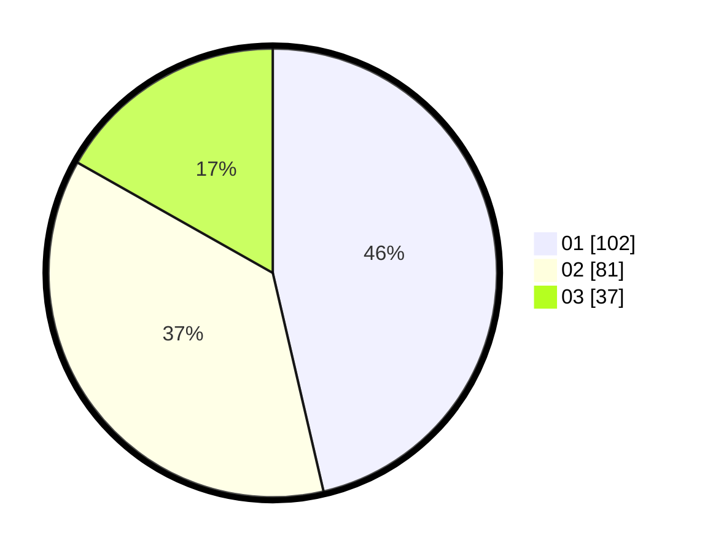

# Hasil

Hasil perolehan suara paslon dapat dilihat pada file paslon-01.txt, paslon-02.txt, dan paslon-03.txt.

Jika tidak ada, artinya data tersebut belum ada pada SIREKAP.

## Perolehan Suara

 * Paslon 01: **102**.
 * Paslon 02: **81**.
 * Paslon 03: **37**.

## Foto C Plano

https://sirekap-obj-formc.kpu.go.id/de68/pemilu/ppwp/31/74/04/10/02/3174041002023-20240214-193001--0f1cfeb0-3b31-43c6-a45c-28b92dd0329c.jpg

https://sirekap-obj-formc.kpu.go.id/de68/pemilu/ppwp/31/74/04/10/02/3174041002023-20240214-193009--7ab31f44-8988-4d90-adfe-64f42b581d91.jpg

https://sirekap-obj-formc.kpu.go.id/de68/pemilu/ppwp/31/74/04/10/02/3174041002023-20240214-193016--4e159b87-a23e-465f-8d07-c4e6a09574c9.jpg

## DATA PEMILIH TETAP

Jumlah pemilih dalam DPT: **274**.
 * L: **138**.
 * P: **136**.

## DATA PENGGUNA HAK PILIH

Jumlah pengguna hak pilih dalam DPT: **210**.
 * L: **107**.
 * P: **103**.

Jumlah pengguna hak pilih dalam DPTb: **12**.
 * L: **0**.
 * P: **12**.

Jumlah pengguna hak pilih dalam DPK: **0**.
 * L: **0**.
 * P: **0**.

Jumlah pengguna hak pilih: **222**.
 * L: **107**.
 * P: **115**.

## JUMLAH SUARA SAH DAN TIDAK SAH

JUMLAH SELURUH SUARA SAH: **220**.

JUMLAH SUARA TIDAK SAH: **2**.

JUMLAH SELURUH SUARA SAH DAN SUARA TIDAK SAH: **222**.
