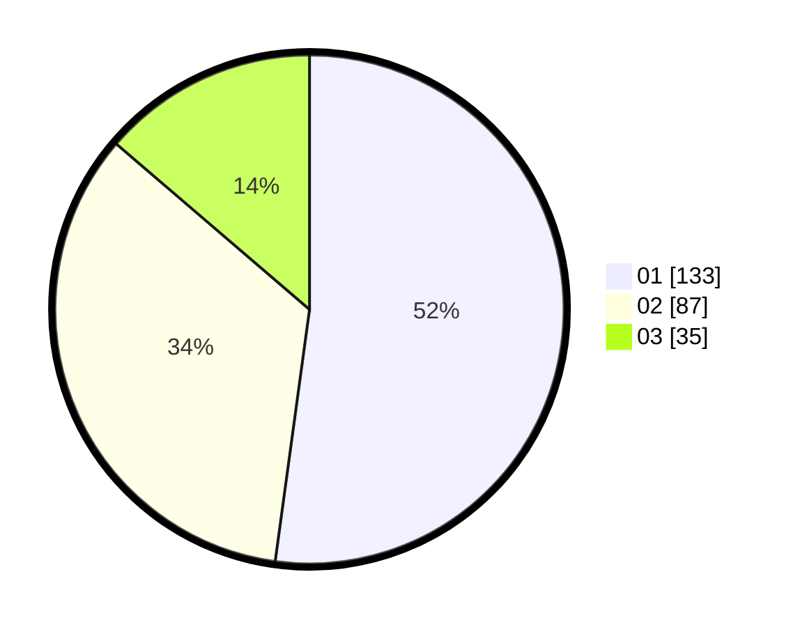

# Hasil

Hasil perolehan suara paslon dapat dilihat pada file paslon-01.txt, paslon-02.txt, dan paslon-03.txt.

Jika tidak ada, artinya data tersebut belum ada pada SIREKAP.

## Perolehan Suara

 * Paslon 01: **133**.
 * Paslon 02: **87**.
 * Paslon 03: **35**.

## Foto C Plano

https://sirekap-obj-formc.kpu.go.id/9931/pemilu/ppwp/31/74/04/10/02/3174041002024-20240214-202319--6fe292be-0e5b-4d08-aff5-c078544758d1.jpg

https://sirekap-obj-formc.kpu.go.id/9931/pemilu/ppwp/31/74/04/10/02/3174041002024-20240214-202518--495a4c9d-c02d-4a19-b30b-2ff2cf348c4e.jpg

https://sirekap-obj-formc.kpu.go.id/9931/pemilu/ppwp/31/74/04/10/02/3174041002024-20240214-202612--39111bde-f7f2-46c5-b018-7f626a09a5c9.jpg

## DATA PEMILIH TETAP

Jumlah pemilih dalam DPT: **277**.
 * L: **143**.
 * P: **134**.

## DATA PENGGUNA HAK PILIH

Jumlah pengguna hak pilih dalam DPT: **242**.
 * L: **125**.
 * P: **117**.

Jumlah pengguna hak pilih dalam DPTb: **12**.
 * L: **1**.
 * P: **11**.

Jumlah pengguna hak pilih dalam DPK: **5**.
 * L: **3**.
 * P: **2**.

Jumlah pengguna hak pilih: **259**.
 * L: **129**.
 * P: **130**.

## JUMLAH SUARA SAH DAN TIDAK SAH

JUMLAH SELURUH SUARA SAH: **255**.

JUMLAH SUARA TIDAK SAH: **4**.

JUMLAH SELURUH SUARA SAH DAN SUARA TIDAK SAH: **259**.
