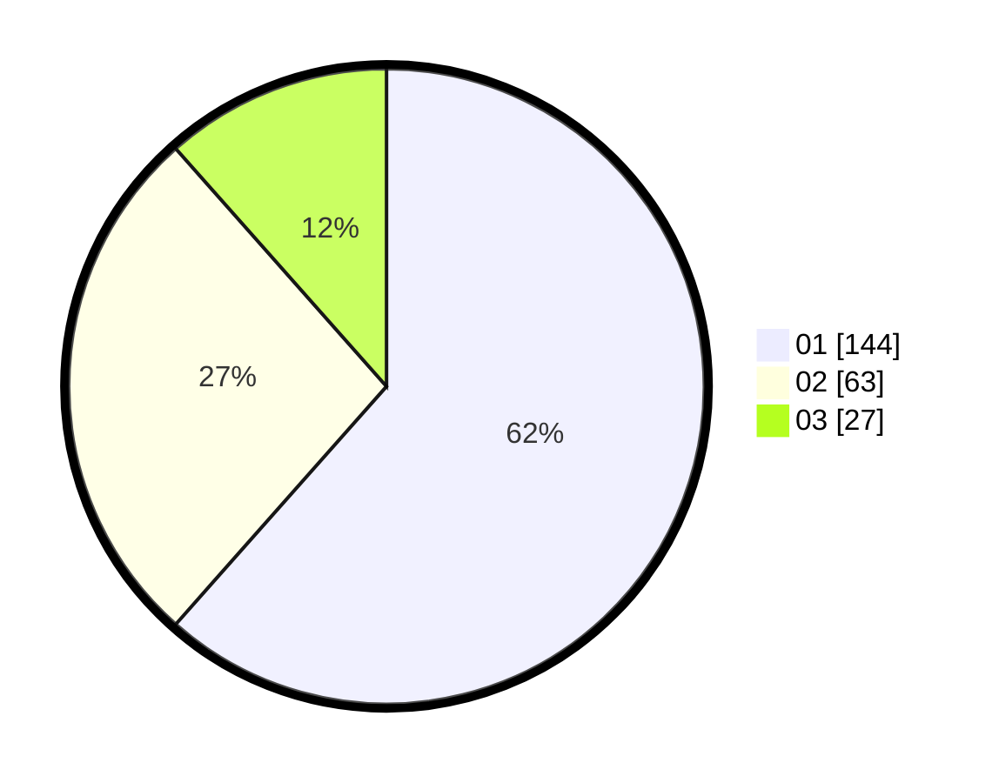

# Hasil

Hasil perolehan suara paslon dapat dilihat pada file paslon-01.txt, paslon-02.txt, dan paslon-03.txt.

Jika tidak ada, artinya data tersebut belum ada pada SIREKAP.

## Perolehan Suara

 * Paslon 01: **144**.
 * Paslon 02: **63**.
 * Paslon 03: **27**.

## Foto C Plano

https://sirekap-obj-formc.kpu.go.id/1623/pemilu/ppwp/31/74/04/10/02/3174041002025-20240216-094515--1bd10347-424a-49b5-8dd5-1dbb8d075a54.jpg

https://sirekap-obj-formc.kpu.go.id/1623/pemilu/ppwp/31/74/04/10/02/3174041002025-20240216-094517--c263930e-b3e5-4e9c-a051-a17ef4858ddb.jpg

https://sirekap-obj-formc.kpu.go.id/1623/pemilu/ppwp/31/74/04/10/02/3174041002025-20240216-094516--91186137-ff59-4557-a59f-923a53795d3b.jpg

## DATA PEMILIH TETAP

Jumlah pemilih dalam DPT: **258**.
 * L: **123**.
 * P: **135**.

## DATA PENGGUNA HAK PILIH

Jumlah pengguna hak pilih dalam DPT: **226**.
 * L: **107**.
 * P: **119**.

Jumlah pengguna hak pilih dalam DPTb: **10**.
 * L: **4**.
 * P: **6**.

Jumlah pengguna hak pilih dalam DPK: **0**.
 * L: **0**.
 * P: **0**.

Jumlah pengguna hak pilih: **236**.
 * L: **111**.
 * P: **125**.

## JUMLAH SUARA SAH DAN TIDAK SAH

JUMLAH SELURUH SUARA SAH: **234**.

JUMLAH SUARA TIDAK SAH: **2**.

JUMLAH SELURUH SUARA SAH DAN SUARA TIDAK SAH: **236**.
