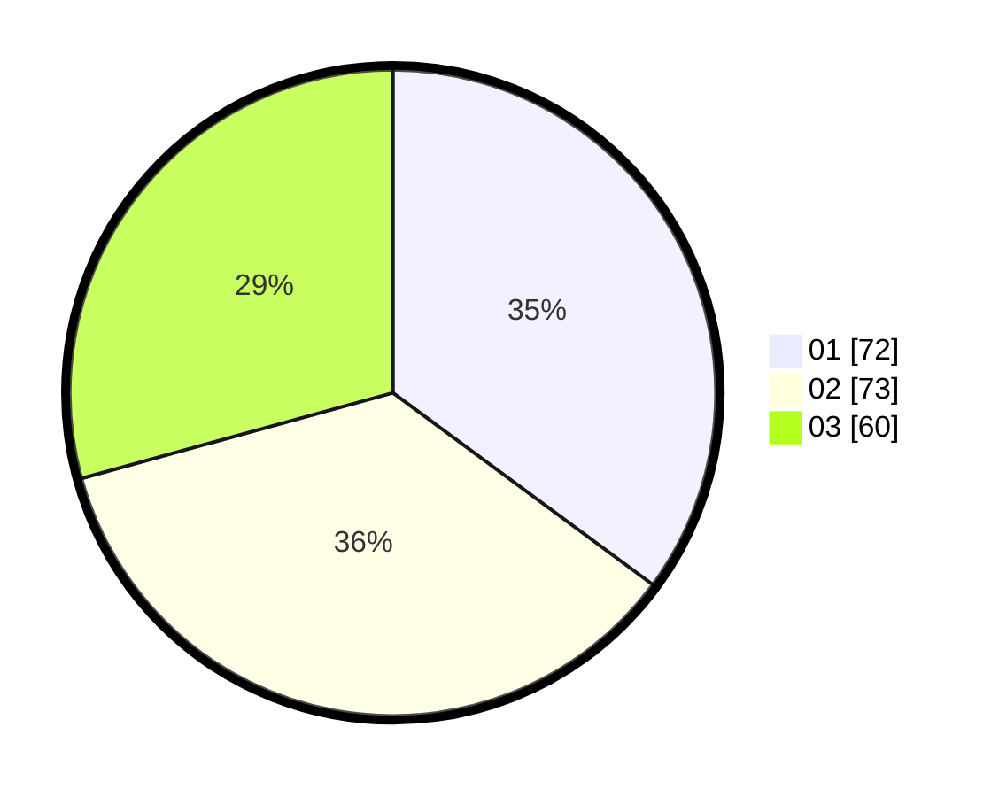

# Hasil

Hasil perolehan suara paslon dapat dilihat pada file paslon-01.txt, paslon-02.txt, dan paslon-03.txt.

Jika tidak ada, artinya data tersebut belum ada pada SIREKAP.

## Perolehan Suara

 * Paslon 01: **72**.
 * Paslon 02: **73**.
 * Paslon 03: **60**.

## Foto C Plano

https://sirekap-obj-formc.kpu.go.id/7ca9/pemilu/ppwp/31/74/04/10/02/3174041002037-20240215-204259--8a9866c5-aa59-4f19-b2ff-6b4bb9808026.jpg

https://sirekap-obj-formc.kpu.go.id/7ca9/pemilu/ppwp/31/74/04/10/02/3174041002037-20240215-204302--286b0345-100c-44d0-817b-1a423165ae18.jpg

https://sirekap-obj-formc.kpu.go.id/7ca9/pemilu/ppwp/31/74/04/10/02/3174041002037-20240215-204300--63e544e1-3067-4113-b4f6-4625469adf3f.jpg

## DATA PEMILIH TETAP

Jumlah pemilih dalam DPT: **248**.
 * L: **124**.
 * P: **124**.

## DATA PENGGUNA HAK PILIH

Jumlah pengguna hak pilih dalam DPT: **192**.
 * L: **92**.
 * P: **100**.

Jumlah pengguna hak pilih dalam DPTb: **11**.
 * L: **3**.
 * P: **8**.

Jumlah pengguna hak pilih dalam DPK: **2**.
 * L: **1**.
 * P: **1**.

Jumlah pengguna hak pilih: **205**.
 * L: **96**.
 * P: **109**.

## JUMLAH SUARA SAH DAN TIDAK SAH

JUMLAH SELURUH SUARA SAH: **205**.

JUMLAH SUARA TIDAK SAH: **4**.

JUMLAH SELURUH SUARA SAH DAN SUARA TIDAK SAH: **209**.
