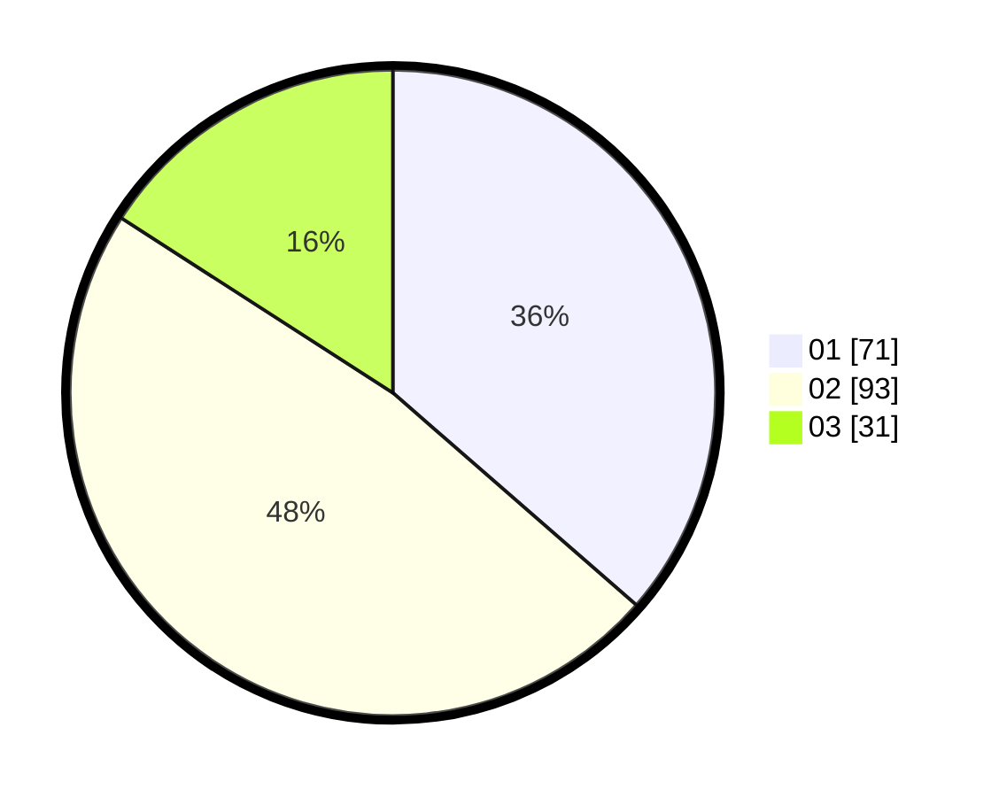

# Hasil

Hasil perolehan suara paslon dapat dilihat pada file paslon-01.txt, paslon-02.txt, dan paslon-03.txt.

Jika tidak ada, artinya data tersebut belum ada pada SIREKAP.

## Perolehan Suara

 * Paslon 01: **71**.
 * Paslon 02: **93**.
 * Paslon 03: **31**.

## Foto C Plano

https://sirekap-obj-formc.kpu.go.id/af56/pemilu/ppwp/31/74/04/10/02/3174041002040-20240214-155102--6400cb65-d86f-4e4b-bdbe-6477b506fb42.jpg

https://sirekap-obj-formc.kpu.go.id/af56/pemilu/ppwp/31/74/04/10/02/3174041002040-20240214-155146--e347f0fb-0d06-4012-9b3a-7772c7c25b08.jpg

https://sirekap-obj-formc.kpu.go.id/af56/pemilu/ppwp/31/74/04/10/02/3174041002040-20240214-155253--ab578159-cba4-4758-ac2a-674e1848334f.jpg

## DATA PEMILIH TETAP

Jumlah pemilih dalam DPT: **219**.
 * L: **106**.
 * P: **113**.

## DATA PENGGUNA HAK PILIH

Jumlah pengguna hak pilih dalam DPT: **191**.
 * L: **91**.
 * P: **100**.

Jumlah pengguna hak pilih dalam DPTb: **4**.
 * L: **0**.
 * P: **4**.

Jumlah pengguna hak pilih dalam DPK: **1**.
 * L: **1**.
 * P: **0**.

Jumlah pengguna hak pilih: **196**.
 * L: **92**.
 * P: **104**.

## JUMLAH SUARA SAH DAN TIDAK SAH

JUMLAH SELURUH SUARA SAH: **195**.

JUMLAH SUARA TIDAK SAH: **1**.

JUMLAH SELURUH SUARA SAH DAN SUARA TIDAK SAH: **196**.
