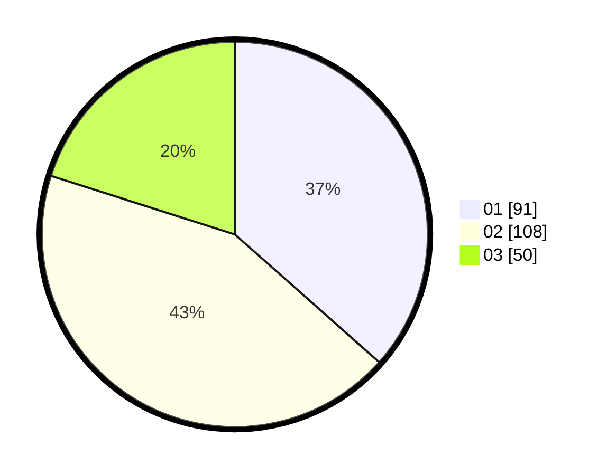

# Hasil

Hasil perolehan suara paslon dapat dilihat pada file paslon-01.txt, paslon-02.txt, dan paslon-03.txt.

Jika tidak ada, artinya data tersebut belum ada pada SIREKAP.

## Perolehan Suara

 * Paslon 01: **91**.
 * Paslon 02: **108**.
 * Paslon 03: **50**.

## Foto C Plano

https://sirekap-obj-formc.kpu.go.id/bea4/pemilu/ppwp/31/74/04/10/02/3174041002046-20240216-021113--40f920c9-4858-47ae-9378-7f68b8e6f0ca.jpg

https://sirekap-obj-formc.kpu.go.id/bea4/pemilu/ppwp/31/74/04/10/02/3174041002046-20240216-021115--de7060bb-e45a-49b7-8388-3daeeff7764c.jpg

https://sirekap-obj-formc.kpu.go.id/bea4/pemilu/ppwp/31/74/04/10/02/3174041002046-20240216-021114--55bb23b2-5287-4e5d-ae27-ba43e3cdfeb8.jpg

## DATA PEMILIH TETAP

Jumlah pemilih dalam DPT: **0**.
 * L: **0**.
 * P: **0**.

## DATA PENGGUNA HAK PILIH

Jumlah pengguna hak pilih dalam DPT: **0**.
 * L: **0**.
 * P: **0**.

Jumlah pengguna hak pilih dalam DPTb: **0**.
 * L: **0**.
 * P: **0**.

Jumlah pengguna hak pilih dalam DPK: **0**.
 * L: **0**.
 * P: **0**.

Jumlah pengguna hak pilih: **0**.
 * L: **0**.
 * P: **0**.

## JUMLAH SUARA SAH DAN TIDAK SAH

JUMLAH SELURUH SUARA SAH: **249**.

JUMLAH SUARA TIDAK SAH: **3**.

JUMLAH SELURUH SUARA SAH DAN SUARA TIDAK SAH: **252**.
