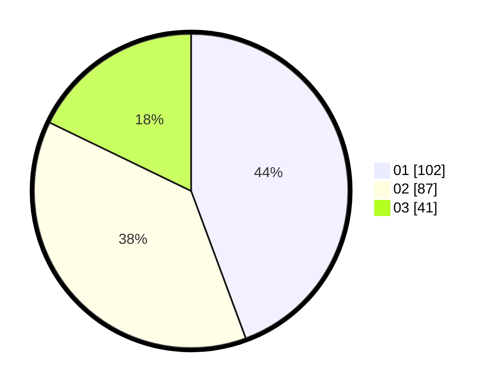

# Hasil

Hasil perolehan suara paslon dapat dilihat pada file paslon-01.txt, paslon-02.txt, dan paslon-03.txt.

Jika tidak ada, artinya data tersebut belum ada pada SIREKAP.

## Perolehan Suara

 * Paslon 01: **102**.
 * Paslon 02: **87**.
 * Paslon 03: **41**.

## Foto C Plano

https://sirekap-obj-formc.kpu.go.id/273e/pemilu/ppwp/31/74/04/10/02/3174041002051-20240214-222053--483fe4f8-681f-44c0-ae51-23244e8dacf6.jpg

https://sirekap-obj-formc.kpu.go.id/273e/pemilu/ppwp/31/74/04/10/02/3174041002051-20240214-221954--1d929692-19a8-47fe-a398-6c439911eb18.jpg

https://sirekap-obj-formc.kpu.go.id/273e/pemilu/ppwp/31/74/04/10/02/3174041002051-20240214-201151--b0cb5d28-84e7-43c1-b79d-aebfb9064b25.jpg

## DATA PEMILIH TETAP

Jumlah pemilih dalam DPT: **264**.
 * L: **139**.
 * P: **125**.

## DATA PENGGUNA HAK PILIH

Jumlah pengguna hak pilih dalam DPT: **224**.
 * L: **114**.
 * P: **110**.

Jumlah pengguna hak pilih dalam DPTb: **7**.
 * L: **2**.
 * P: **5**.

Jumlah pengguna hak pilih dalam DPK: **1**.
 * L: **0**.
 * P: **1**.

Jumlah pengguna hak pilih: **232**.
 * L: **116**.
 * P: **116**.

## JUMLAH SUARA SAH DAN TIDAK SAH

JUMLAH SELURUH SUARA SAH: **230**.

JUMLAH SUARA TIDAK SAH: **2**.

JUMLAH SELURUH SUARA SAH DAN SUARA TIDAK SAH: **232**.
