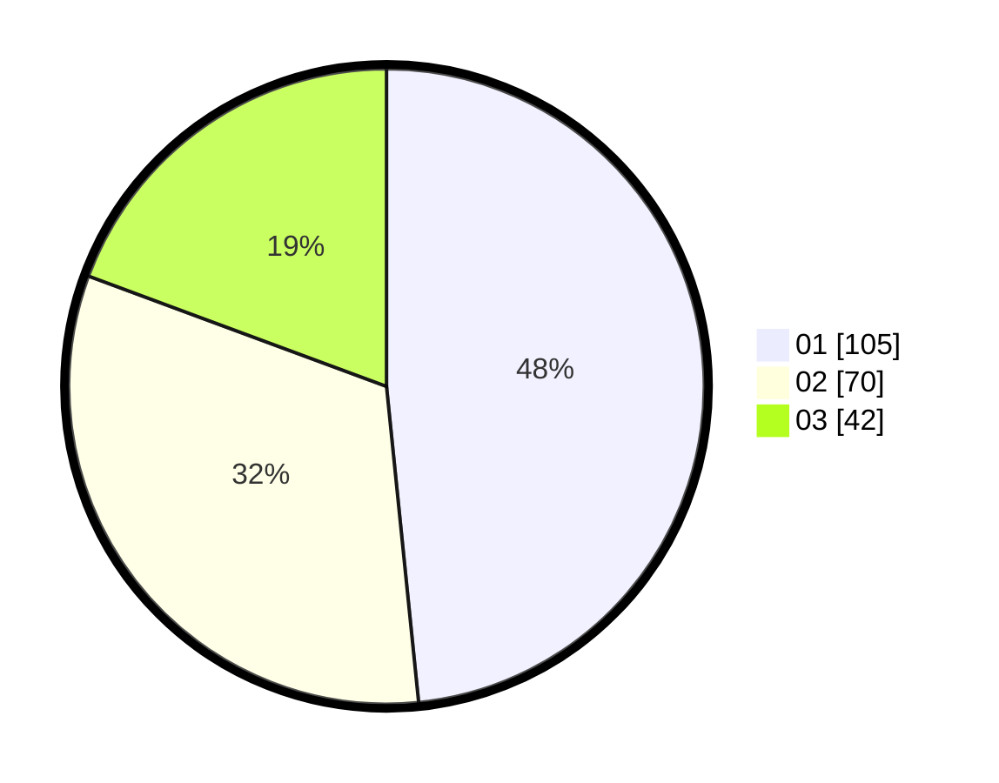

# Hasil

Hasil perolehan suara paslon dapat dilihat pada file paslon-01.txt, paslon-02.txt, dan paslon-03.txt.

Jika tidak ada, artinya data tersebut belum ada pada SIREKAP.

## Perolehan Suara

 * Paslon 01: **105**.
 * Paslon 02: **70**.
 * Paslon 03: **42**.

## Foto C Plano

https://sirekap-obj-formc.kpu.go.id/30bc/pemilu/ppwp/31/74/04/10/02/3174041002056-20240218-062348--75620ae6-f2bf-44de-914d-0be284aeb40d.jpg

https://sirekap-obj-formc.kpu.go.id/30bc/pemilu/ppwp/31/74/04/10/02/3174041002056-20240218-062350--c8eea0e0-2495-45e9-9eef-552569070b81.jpg

https://sirekap-obj-formc.kpu.go.id/30bc/pemilu/ppwp/31/74/04/10/02/3174041002056-20240218-062349--1c59e838-5375-4f32-bb23-7067c0e2c11a.jpg

## DATA PEMILIH TETAP

Jumlah pemilih dalam DPT: **261**.
 * L: **137**.
 * P: **124**.

## DATA PENGGUNA HAK PILIH

Jumlah pengguna hak pilih dalam DPT: **212**.
 * L: **105**.
 * P: **107**.

Jumlah pengguna hak pilih dalam DPTb: **7**.
 * L: **0**.
 * P: **7**.

Jumlah pengguna hak pilih dalam DPK: **2**.
 * L: **0**.
 * P: **2**.

Jumlah pengguna hak pilih: **221**.
 * L: **105**.
 * P: **116**.

## JUMLAH SUARA SAH DAN TIDAK SAH

JUMLAH SELURUH SUARA SAH: **216**.

JUMLAH SUARA TIDAK SAH: **3**.

JUMLAH SELURUH SUARA SAH DAN SUARA TIDAK SAH: **219**.
