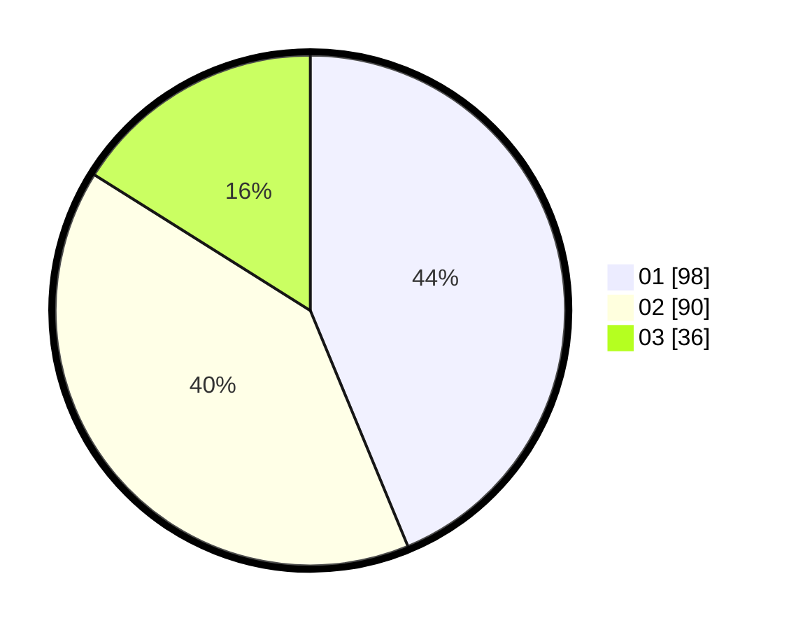

# Hasil

Hasil perolehan suara paslon dapat dilihat pada file paslon-01.txt, paslon-02.txt, dan paslon-03.txt.

Jika tidak ada, artinya data tersebut belum ada pada SIREKAP.

## Perolehan Suara

 * Paslon 01: **98**.
 * Paslon 02: **90**.
 * Paslon 03: **36**.

## Foto C Plano

https://sirekap-obj-formc.kpu.go.id/a399/pemilu/ppwp/31/74/04/10/02/3174041002059-20240214-184747--ed02c72c-0779-45c5-ac36-0a59b1e77372.jpg

https://sirekap-obj-formc.kpu.go.id/a399/pemilu/ppwp/31/74/04/10/02/3174041002059-20240214-184740--b06e86f5-baec-46cb-b850-f4dc5941c9a9.jpg

https://sirekap-obj-formc.kpu.go.id/a399/pemilu/ppwp/31/74/04/10/02/3174041002059-20240214-175319--809bcd64-801d-4f03-9575-2ba7e9b8abca.jpg

## DATA PEMILIH TETAP

Jumlah pemilih dalam DPT: **272**.
 * L: **134**.
 * P: **138**.

## DATA PENGGUNA HAK PILIH

Jumlah pengguna hak pilih dalam DPT: **224**.
 * L: **109**.
 * P: **115**.

Jumlah pengguna hak pilih dalam DPTb: **3**.
 * L: **1**.
 * P: **2**.

Jumlah pengguna hak pilih dalam DPK: **0**.
 * L: **0**.
 * P: **0**.

Jumlah pengguna hak pilih: **227**.
 * L: **110**.
 * P: **117**.

## JUMLAH SUARA SAH DAN TIDAK SAH

JUMLAH SELURUH SUARA SAH: **224**.

JUMLAH SUARA TIDAK SAH: **3**.

JUMLAH SELURUH SUARA SAH DAN SUARA TIDAK SAH: **227**.
