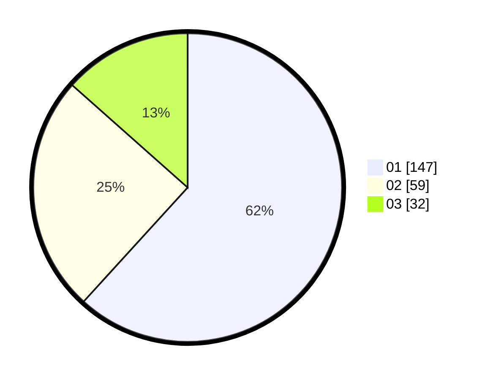

# Hasil

Hasil perolehan suara paslon dapat dilihat pada file paslon-01.txt, paslon-02.txt, dan paslon-03.txt.

Jika tidak ada, artinya data tersebut belum ada pada SIREKAP.

## Perolehan Suara

 * Paslon 01: **147**.
 * Paslon 02: **59**.
 * Paslon 03: **32**.

## Foto C Plano

https://sirekap-obj-formc.kpu.go.id/f013/pemilu/ppwp/31/74/04/10/02/3174041002069-20240216-115332--8f21702c-ec8f-4549-aac6-7c00f389dcd3.jpg

https://sirekap-obj-formc.kpu.go.id/f013/pemilu/ppwp/31/74/04/10/02/3174041002069-20240216-115334--4ed1502a-74ec-4f7a-b92e-2d8879198f79.jpg

https://sirekap-obj-formc.kpu.go.id/f013/pemilu/ppwp/31/74/04/10/02/3174041002069-20240216-115333--0b8e5ff7-3e34-404d-940f-99ee5ec22426.jpg

## DATA PEMILIH TETAP

Jumlah pemilih dalam DPT: **27**.
 * L: **139**.
 * P: **138**.

## DATA PENGGUNA HAK PILIH

Jumlah pengguna hak pilih dalam DPT: **232**.
 * L: **113**.
 * P: **122**.

Jumlah pengguna hak pilih dalam DPTb: **1**.
 * L: **3**.
 * P: **1**.

Jumlah pengguna hak pilih dalam DPK: **2**.
 * L: **1**.
 * P: **1**.

Jumlah pengguna hak pilih: **241**.
 * L: **117**.
 * P: **124**.

## JUMLAH SUARA SAH DAN TIDAK SAH

JUMLAH SELURUH SUARA SAH: **238**.

JUMLAH SUARA TIDAK SAH: **3**.

JUMLAH SELURUH SUARA SAH DAN SUARA TIDAK SAH: **241**.
