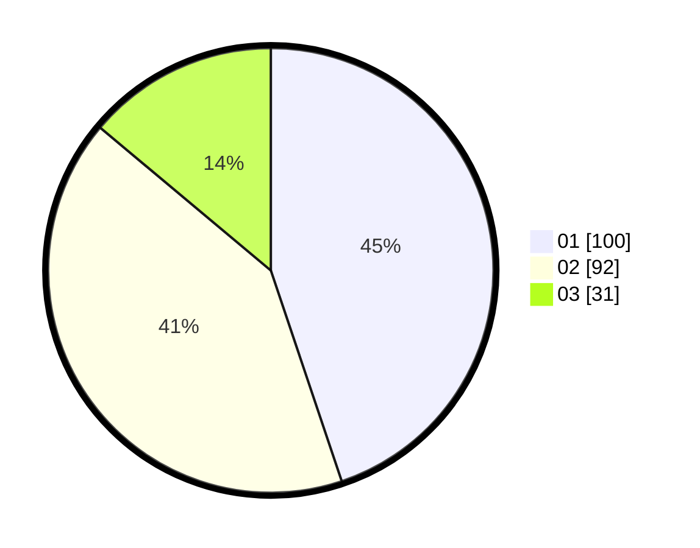

# Hasil

Hasil perolehan suara paslon dapat dilihat pada file paslon-01.txt, paslon-02.txt, dan paslon-03.txt.

Jika tidak ada, artinya data tersebut belum ada pada SIREKAP.

## Perolehan Suara

 * Paslon 01: **100**.
 * Paslon 02: **92**.
 * Paslon 03: **31**.

## Foto C Plano

https://sirekap-obj-formc.kpu.go.id/c812/pemilu/ppwp/31/74/04/10/02/3174041002071-20240215-232619--3c8c8b6d-761d-47d2-8199-db8cd7cde18b.jpg

https://sirekap-obj-formc.kpu.go.id/c812/pemilu/ppwp/31/74/04/10/02/3174041002071-20240215-232622--1befed62-858f-4be9-813d-f6f6c93de011.jpg

https://sirekap-obj-formc.kpu.go.id/c812/pemilu/ppwp/31/74/04/10/02/3174041002071-20240215-232621--807c2f6d-e4a2-45b3-808d-b0091be321c9.jpg

## DATA PEMILIH TETAP

Jumlah pemilih dalam DPT: **277**.
 * L: **135**.
 * P: **142**.

## DATA PENGGUNA HAK PILIH

Jumlah pengguna hak pilih dalam DPT: **217**.
 * L: **98**.
 * P: **119**.

Jumlah pengguna hak pilih dalam DPTb: **6**.
 * L: **1**.
 * P: **5**.

Jumlah pengguna hak pilih dalam DPK: **1**.
 * L: **0**.
 * P: **1**.

Jumlah pengguna hak pilih: **224**.
 * L: **99**.
 * P: **125**.

## JUMLAH SUARA SAH DAN TIDAK SAH

JUMLAH SELURUH SUARA SAH: **223**.

JUMLAH SUARA TIDAK SAH: **1**.

JUMLAH SELURUH SUARA SAH DAN SUARA TIDAK SAH: **224**.
