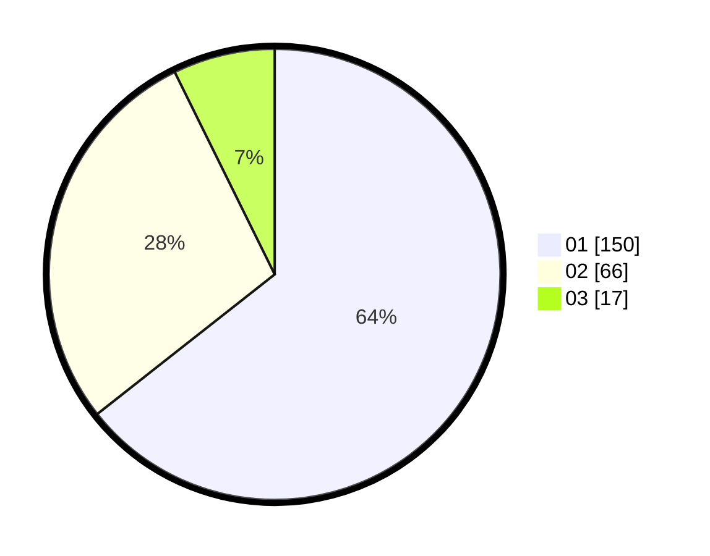

# Hasil

Hasil perolehan suara paslon dapat dilihat pada file paslon-01.txt, paslon-02.txt, dan paslon-03.txt.

Jika tidak ada, artinya data tersebut belum ada pada SIREKAP.

## Perolehan Suara

 * Paslon 01: **150**.
 * Paslon 02: **66**.
 * Paslon 03: **17**.

## Foto C Plano

https://sirekap-obj-formc.kpu.go.id/c9b5/pemilu/ppwp/31/74/04/10/02/3174041002073-20240215-011403--f2a57bea-5cfc-4e05-a2d2-4c81bbad3bad.jpg

https://sirekap-obj-formc.kpu.go.id/c9b5/pemilu/ppwp/31/74/04/10/02/3174041002073-20240215-011416--a427f673-8807-4622-8d0c-e149e518bfe8.jpg

https://sirekap-obj-formc.kpu.go.id/c9b5/pemilu/ppwp/31/74/04/10/02/3174041002073-20240215-011423--e1d65e72-49d2-4bda-ad15-c52dc6f4b794.jpg
