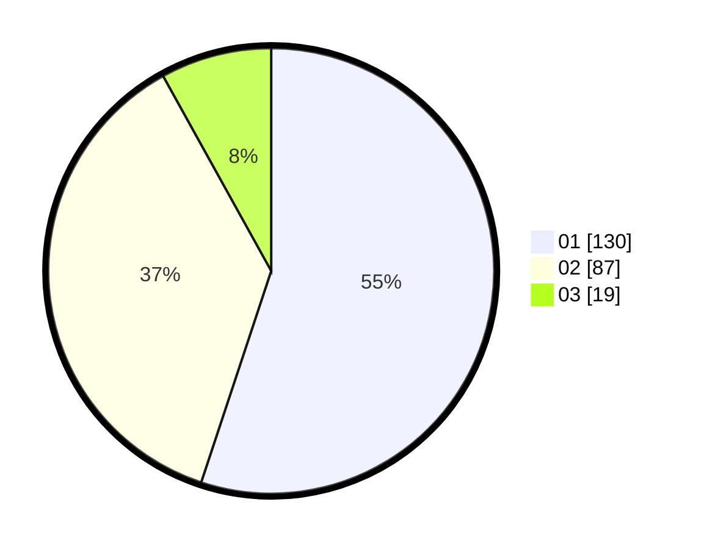

# Hasil

Hasil perolehan suara paslon dapat dilihat pada file paslon-01.txt, paslon-02.txt, dan paslon-03.txt.

Jika tidak ada, artinya data tersebut belum ada pada SIREKAP.

## Perolehan Suara

 * Paslon 01: **130**.
 * Paslon 02: **87**.
 * Paslon 03: **19**.

## Foto C Plano

https://sirekap-obj-formc.kpu.go.id/1567/pemilu/ppwp/31/74/04/10/02/3174041002074-20240214-155137--58f1f4c7-f1f6-45f0-83c6-0fb034e043a9.jpg

https://sirekap-obj-formc.kpu.go.id/1567/pemilu/ppwp/31/74/04/10/02/3174041002074-20240214-155144--d2f56f04-5104-4ae0-b7ab-1b42d1520544.jpg

https://sirekap-obj-formc.kpu.go.id/1567/pemilu/ppwp/31/74/04/10/02/3174041002074-20240214-155149--ce34b10e-4ca9-4b19-b492-e336e517c689.jpg

## DATA PEMILIH TETAP

Jumlah pemilih dalam DPT: **299**.
 * L: **160**.
 * P: **139**.

## DATA PENGGUNA HAK PILIH

Jumlah pengguna hak pilih dalam DPT: **237**.
 * L: **116**.
 * P: **121**.

Jumlah pengguna hak pilih dalam DPTb: **4**.
 * L: **2**.
 * P: **2**.

Jumlah pengguna hak pilih dalam DPK: **0**.
 * L: **0**.
 * P: **0**.

Jumlah pengguna hak pilih: **241**.
 * L: **118**.
 * P: **123**.

## JUMLAH SUARA SAH DAN TIDAK SAH

JUMLAH SELURUH SUARA SAH: **236**.

JUMLAH SUARA TIDAK SAH: **5**.

JUMLAH SELURUH SUARA SAH DAN SUARA TIDAK SAH: **241**.
