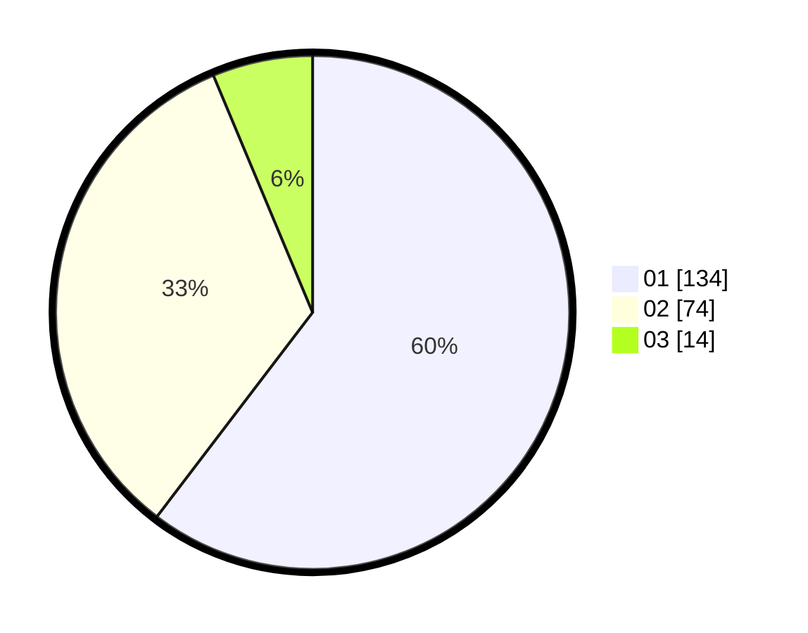

# Hasil

Hasil perolehan suara paslon dapat dilihat pada file paslon-01.txt, paslon-02.txt, dan paslon-03.txt.

Jika tidak ada, artinya data tersebut belum ada pada SIREKAP.

## Perolehan Suara

 * Paslon 01: **134**.
 * Paslon 02: **74**.
 * Paslon 03: **14**.

## Foto C Plano

https://sirekap-obj-formc.kpu.go.id/34c0/pemilu/ppwp/31/74/04/10/02/3174041002078-20240216-122528--7f89ea66-efb1-4554-b189-5f331c2cbcc4.jpg

https://sirekap-obj-formc.kpu.go.id/34c0/pemilu/ppwp/31/74/04/10/02/3174041002078-20240216-122531--139c4abc-a70e-4eb9-bb90-966cfb268a22.jpg

https://sirekap-obj-formc.kpu.go.id/34c0/pemilu/ppwp/31/74/04/10/02/3174041002078-20240216-122530--ca248d96-da1b-443b-bf30-17a9965a80bf.jpg

## DATA PEMILIH TETAP

Jumlah pemilih dalam DPT: **280**.
 * L: **134**.
 * P: **146**.

## DATA PENGGUNA HAK PILIH

Jumlah pengguna hak pilih dalam DPT: **223**.
 * L: **108**.
 * P: **115**.

Jumlah pengguna hak pilih dalam DPTb: **2**.
 * L: **1**.
 * P: **1**.

Jumlah pengguna hak pilih dalam DPK: **0**.
 * L: **0**.
 * P: **0**.

Jumlah pengguna hak pilih: **225**.
 * L: **109**.
 * P: **116**.

## JUMLAH SUARA SAH DAN TIDAK SAH

JUMLAH SELURUH SUARA SAH: **222**.

JUMLAH SUARA TIDAK SAH: **3**.

JUMLAH SELURUH SUARA SAH DAN SUARA TIDAK SAH: **225**.
