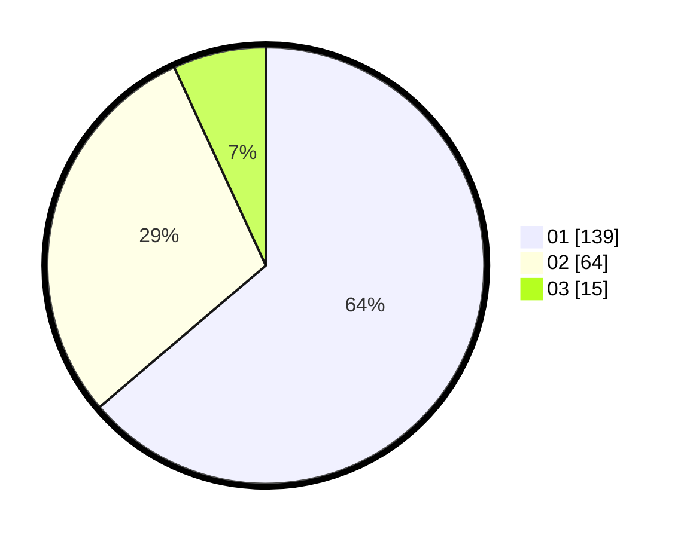

# Hasil

Hasil perolehan suara paslon dapat dilihat pada file paslon-01.txt, paslon-02.txt, dan paslon-03.txt.

Jika tidak ada, artinya data tersebut belum ada pada SIREKAP.

## Perolehan Suara

 * Paslon 01: **139**.
 * Paslon 02: **64**.
 * Paslon 03: **15**.

## Foto C Plano

https://sirekap-obj-formc.kpu.go.id/3772/pemilu/ppwp/31/74/04/10/02/3174041002079-20240216-003258--7080631c-e218-4822-abef-b1b369d47948.jpg

https://sirekap-obj-formc.kpu.go.id/3772/pemilu/ppwp/31/74/04/10/02/3174041002079-20240216-003303--67f0ee34-0a9c-46f8-b7cf-2e865a7ec05b.jpg

https://sirekap-obj-formc.kpu.go.id/3772/pemilu/ppwp/31/74/04/10/02/3174041002079-20240216-003300--4653a772-5c42-4f11-8b81-2ff24adcc3b0.jpg

## DATA PEMILIH TETAP

Jumlah pemilih dalam DPT: **283**.
 * L: **137**.
 * P: **146**.

## DATA PENGGUNA HAK PILIH

Jumlah pengguna hak pilih dalam DPT: **222**.
 * L: **105**.
 * P: **117**.

Jumlah pengguna hak pilih dalam DPTb: **0**.
 * L: **0**.
 * P: **0**.

Jumlah pengguna hak pilih dalam DPK: **0**.
 * L: **0**.
 * P: **0**.

Jumlah pengguna hak pilih: **222**.
 * L: **105**.
 * P: **117**.

## JUMLAH SUARA SAH DAN TIDAK SAH

JUMLAH SELURUH SUARA SAH: **218**.

JUMLAH SUARA TIDAK SAH: **4**.

JUMLAH SELURUH SUARA SAH DAN SUARA TIDAK SAH: **222**.
