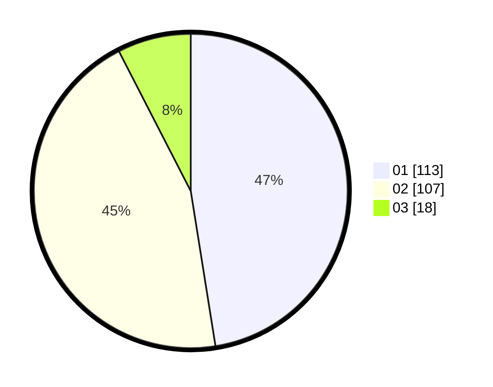

# Hasil

Hasil perolehan suara paslon dapat dilihat pada file paslon-01.txt, paslon-02.txt, dan paslon-03.txt.

Jika tidak ada, artinya data tersebut belum ada pada SIREKAP.

## Perolehan Suara

 * Paslon 01: **113**.
 * Paslon 02: **107**.
 * Paslon 03: **18**.

## Foto C Plano

https://sirekap-obj-formc.kpu.go.id/1386/pemilu/ppwp/31/74/04/10/02/3174041002084-20240216-132224--dbdd375f-12b1-4181-b9c1-b1ec78015499.jpg

https://sirekap-obj-formc.kpu.go.id/1386/pemilu/ppwp/31/74/04/10/02/3174041002084-20240216-132226--6528a9f4-4901-48f1-af0b-074f19b51618.jpg

https://sirekap-obj-formc.kpu.go.id/1386/pemilu/ppwp/31/74/04/10/02/3174041002084-20240216-132225--3a5eef3a-1074-4aa1-a5cd-2a0b2b9f2b79.jpg

## DATA PEMILIH TETAP

Jumlah pemilih dalam DPT: **279**.
 * L: **135**.
 * P: **144**.

## DATA PENGGUNA HAK PILIH

Jumlah pengguna hak pilih dalam DPT: **237**.
 * L: **115**.
 * P: **122**.

Jumlah pengguna hak pilih dalam DPTb: **7**.
 * L: **1**.
 * P: **6**.

Jumlah pengguna hak pilih dalam DPK: **0**.
 * L: **0**.
 * P: **0**.

Jumlah pengguna hak pilih: **244**.
 * L: **116**.
 * P: **128**.

## JUMLAH SUARA SAH DAN TIDAK SAH

JUMLAH SELURUH SUARA SAH: **238**.

JUMLAH SUARA TIDAK SAH: **6**.

JUMLAH SELURUH SUARA SAH DAN SUARA TIDAK SAH: **244**.
