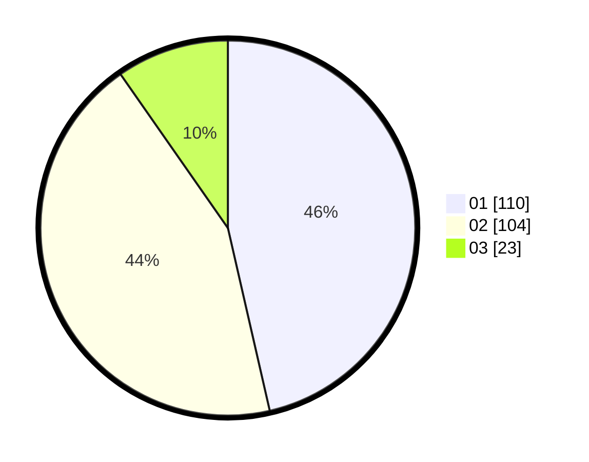

# Hasil

Hasil perolehan suara paslon dapat dilihat pada file paslon-01.txt, paslon-02.txt, dan paslon-03.txt.

Jika tidak ada, artinya data tersebut belum ada pada SIREKAP.

## Perolehan Suara

 * Paslon 01: **110**.
 * Paslon 02: **104**.
 * Paslon 03: **23**.

## Foto C Plano

https://sirekap-obj-formc.kpu.go.id/4469/pemilu/ppwp/31/74/04/10/02/3174041002089-20240216-015933--42c0e2ff-67cf-4cf6-a677-f48cfd19b7d0.jpg

https://sirekap-obj-formc.kpu.go.id/4469/pemilu/ppwp/31/74/04/10/02/3174041002089-20240216-020256--6d615dbe-f733-441f-acf0-1bb30d7073d1.jpg

https://sirekap-obj-formc.kpu.go.id/4469/pemilu/ppwp/31/74/04/10/02/3174041002089-20240216-015934--1823fc4e-3aaa-4ded-9bd1-983c3115afc8.jpg

## DATA PEMILIH TETAP

Jumlah pemilih dalam DPT: **278**.
 * L: **135**.
 * P: **143**.

## DATA PENGGUNA HAK PILIH

Jumlah pengguna hak pilih dalam DPT: **228**.
 * L: **112**.
 * P: **116**.

Jumlah pengguna hak pilih dalam DPTb: **7**.
 * L: **2**.
 * P: **5**.

Jumlah pengguna hak pilih dalam DPK: **4**.
 * L: **1**.
 * P: **3**.

Jumlah pengguna hak pilih: **239**.
 * L: **115**.
 * P: **124**.

## JUMLAH SUARA SAH DAN TIDAK SAH

JUMLAH SELURUH SUARA SAH: **237**.

JUMLAH SUARA TIDAK SAH: **2**.

JUMLAH SELURUH SUARA SAH DAN SUARA TIDAK SAH: **239**.
