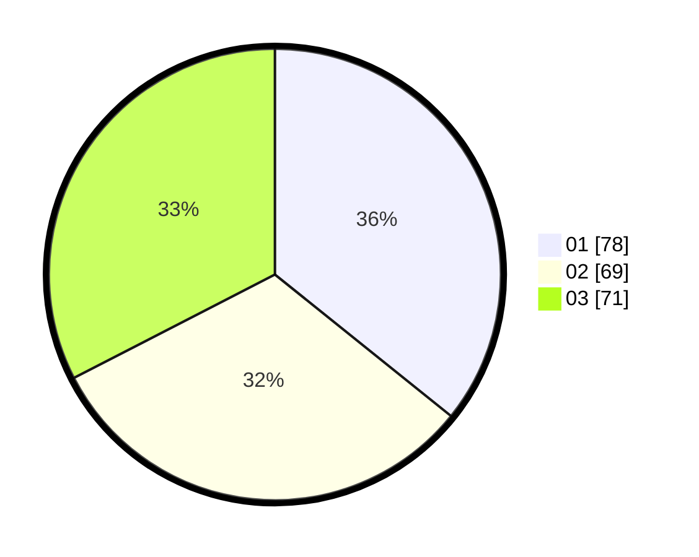

# Hasil

Hasil perolehan suara paslon dapat dilihat pada file paslon-01.txt, paslon-02.txt, dan paslon-03.txt.

Jika tidak ada, artinya data tersebut belum ada pada SIREKAP.

## Perolehan Suara

 * Paslon 01: **78**.
 * Paslon 02: **69**.
 * Paslon 03: **71**.

## Foto C Plano

https://sirekap-obj-formc.kpu.go.id/fb46/pemilu/ppwp/31/74/04/10/02/3174041002095-20240216-132411--1b2d0a3e-a398-4acc-8907-666d20d1e949.jpg

https://sirekap-obj-formc.kpu.go.id/fb46/pemilu/ppwp/31/74/04/10/02/3174041002095-20240216-132412--cc2a002e-626b-429c-95a6-16a39e0e34a8.jpg

https://sirekap-obj-formc.kpu.go.id/fb46/pemilu/ppwp/31/74/04/10/02/3174041002095-20240216-132412--8dc147f7-e974-4160-ba4e-8fb5e040d9c9.jpg

## DATA PEMILIH TETAP

Jumlah pemilih dalam DPT: **233**.
 * L: **101**.
 * P: **132**.

## DATA PENGGUNA HAK PILIH

Jumlah pengguna hak pilih dalam DPT: **202**.
 * L: **87**.
 * P: **115**.

Jumlah pengguna hak pilih dalam DPTb: **16**.
 * L: **2**.
 * P: **14**.

Jumlah pengguna hak pilih dalam DPK: **4**.
 * L: **1**.
 * P: **3**.

Jumlah pengguna hak pilih: **222**.
 * L: **90**.
 * P: **132**.

## JUMLAH SUARA SAH DAN TIDAK SAH

JUMLAH SELURUH SUARA SAH: **218**.

JUMLAH SUARA TIDAK SAH: **4**.

JUMLAH SELURUH SUARA SAH DAN SUARA TIDAK SAH: **222**.
