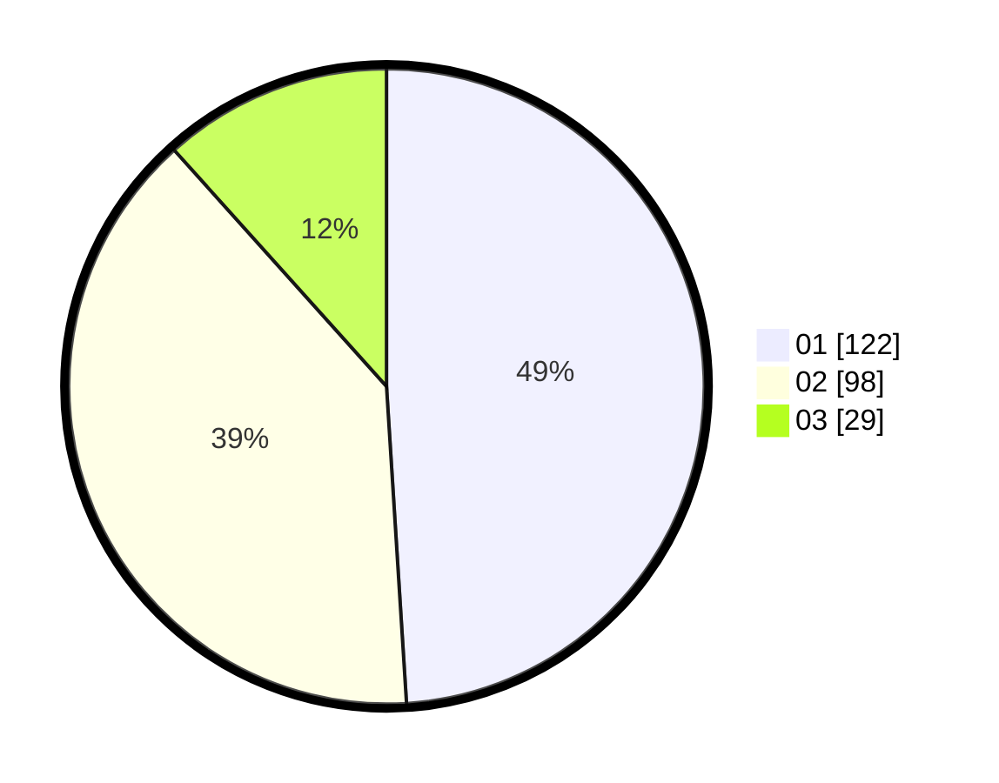

# Hasil

Hasil perolehan suara paslon dapat dilihat pada file paslon-01.txt, paslon-02.txt, dan paslon-03.txt.

Jika tidak ada, artinya data tersebut belum ada pada SIREKAP.

## Perolehan Suara

 * Paslon 01: **122**.
 * Paslon 02: **98**.
 * Paslon 03: **29**.

## Foto C Plano

https://sirekap-obj-formc.kpu.go.id/5c18/pemilu/ppwp/31/74/04/10/02/3174041002097-20240214-211855--798524ba-a923-4e5f-a40f-be7ceef9a8e3.jpg

https://sirekap-obj-formc.kpu.go.id/5c18/pemilu/ppwp/31/74/04/10/02/3174041002097-20240214-212138--c95915dc-8e66-4f5f-91a8-aac15c25235a.jpg

https://sirekap-obj-formc.kpu.go.id/5c18/pemilu/ppwp/31/74/04/10/02/3174041002097-20240214-212259--e9bf87d1-cfd0-4fde-8d91-80a11553b0af.jpg

## DATA PEMILIH TETAP

Jumlah pemilih dalam DPT: **279**.
 * L: **133**.
 * P: **146**.

## DATA PENGGUNA HAK PILIH

Jumlah pengguna hak pilih dalam DPT: **227**.
 * L: **108**.
 * P: **119**.

Jumlah pengguna hak pilih dalam DPTb: **24**.
 * L: **7**.
 * P: **17**.

Jumlah pengguna hak pilih dalam DPK: **0**.
 * L: **0**.
 * P: **0**.

Jumlah pengguna hak pilih: **251**.
 * L: **115**.
 * P: **136**.

## JUMLAH SUARA SAH DAN TIDAK SAH

JUMLAH SELURUH SUARA SAH: **249**.

JUMLAH SUARA TIDAK SAH: **2**.

JUMLAH SELURUH SUARA SAH DAN SUARA TIDAK SAH: **251**.
