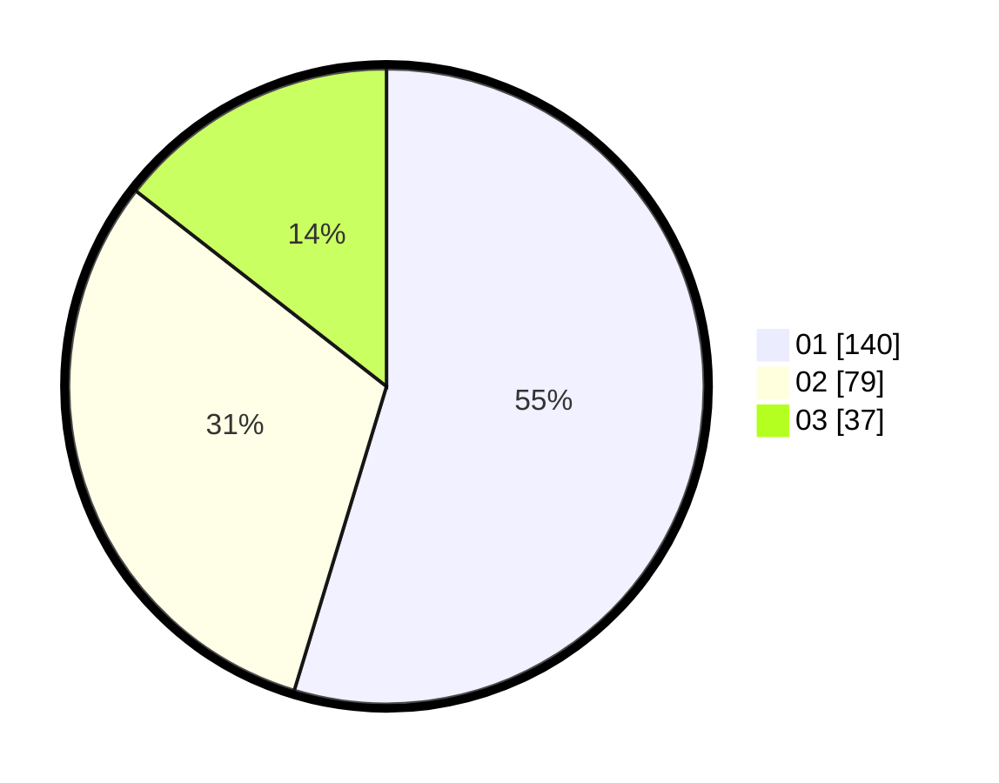

# Hasil

Hasil perolehan suara paslon dapat dilihat pada file paslon-01.txt, paslon-02.txt, dan paslon-03.txt.

Jika tidak ada, artinya data tersebut belum ada pada SIREKAP.

## Perolehan Suara

 * Paslon 01: **140**.
 * Paslon 02: **79**.
 * Paslon 03: **37**.

## Foto C Plano

https://sirekap-obj-formc.kpu.go.id/d07f/pemilu/ppwp/31/74/04/10/02/3174041002101-20240214-155130--e8aa73a9-5cf3-40b0-b8da-a2db37132968.jpg

https://sirekap-obj-formc.kpu.go.id/d07f/pemilu/ppwp/31/74/04/10/02/3174041002101-20240214-155227--480a440e-0a13-4963-be94-1ae49529601d.jpg

https://sirekap-obj-formc.kpu.go.id/d07f/pemilu/ppwp/31/74/04/10/02/3174041002101-20240214-155301--75c0c0c0-c1d8-4ef7-93ba-55a49d6e79b3.jpg

## DATA PEMILIH TETAP

Jumlah pemilih dalam DPT: **277**.
 * L: **132**.
 * P: **145**.

## DATA PENGGUNA HAK PILIH

Jumlah pengguna hak pilih dalam DPT: **242**.
 * L: **112**.
 * P: **130**.

Jumlah pengguna hak pilih dalam DPTb: **14**.
 * L: **5**.
 * P: **9**.

Jumlah pengguna hak pilih dalam DPK: **5**.
 * L: **2**.
 * P: **3**.

Jumlah pengguna hak pilih: **261**.
 * L: **119**.
 * P: **142**.

## JUMLAH SUARA SAH DAN TIDAK SAH

JUMLAH SELURUH SUARA SAH: **256**.

JUMLAH SUARA TIDAK SAH: **5**.

JUMLAH SELURUH SUARA SAH DAN SUARA TIDAK SAH: **261**.
