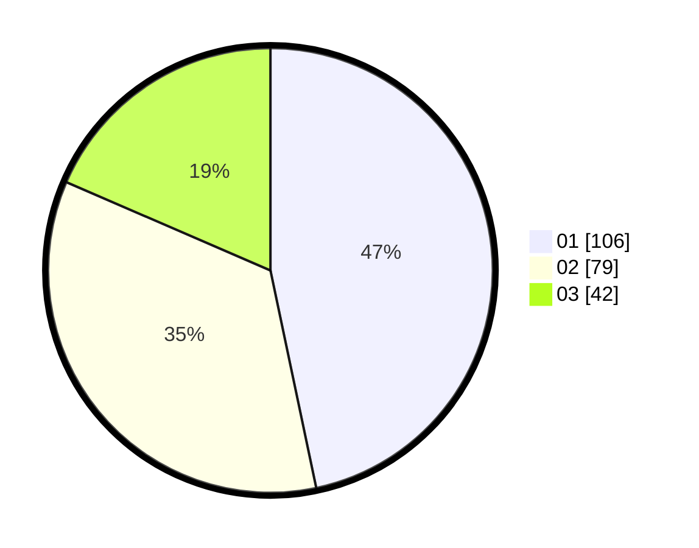

# Hasil

Hasil perolehan suara paslon dapat dilihat pada file paslon-01.txt, paslon-02.txt, dan paslon-03.txt.

Jika tidak ada, artinya data tersebut belum ada pada SIREKAP.

## Perolehan Suara

 * Paslon 01: **106**.
 * Paslon 02: **79**.
 * Paslon 03: **42**.

## Foto C Plano

https://sirekap-obj-formc.kpu.go.id/17a4/pemilu/ppwp/31/74/04/10/02/3174041002106-20240214-185925--9a5f6cb4-1fca-4730-a551-ef9ba6978c74.jpg

https://sirekap-obj-formc.kpu.go.id/17a4/pemilu/ppwp/31/74/04/10/02/3174041002106-20240214-185931--1e5a7c2c-bd9c-420f-bf01-0e74541a9cd6.jpg

https://sirekap-obj-formc.kpu.go.id/17a4/pemilu/ppwp/31/74/04/10/02/3174041002106-20240214-185935--0b9ea3b1-8694-4065-bac7-f58d46b076e6.jpg

## DATA PEMILIH TETAP

Jumlah pemilih dalam DPT: **271**.
 * L: **126**.
 * P: **145**.

## DATA PENGGUNA HAK PILIH

Jumlah pengguna hak pilih dalam DPT: **217**.
 * L: **103**.
 * P: **114**.

Jumlah pengguna hak pilih dalam DPTb: **14**.
 * L: **2**.
 * P: **12**.

Jumlah pengguna hak pilih dalam DPK: **0**.
 * L: **0**.
 * P: **0**.

Jumlah pengguna hak pilih: **231**.
 * L: **105**.
 * P: **126**.

## JUMLAH SUARA SAH DAN TIDAK SAH

JUMLAH SELURUH SUARA SAH: **227**.

JUMLAH SUARA TIDAK SAH: **4**.

JUMLAH SELURUH SUARA SAH DAN SUARA TIDAK SAH: **231**.
