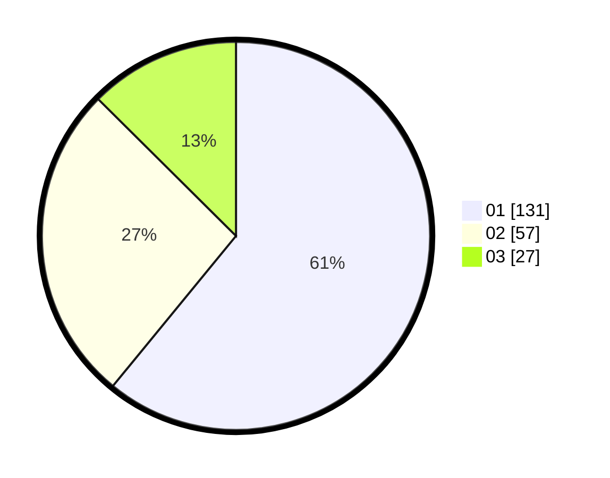

# Hasil

Hasil perolehan suara paslon dapat dilihat pada file paslon-01.txt, paslon-02.txt, dan paslon-03.txt.

Jika tidak ada, artinya data tersebut belum ada pada SIREKAP.

## Perolehan Suara

 * Paslon 01: **131**.
 * Paslon 02: **57**.
 * Paslon 03: **27**.

## Foto C Plano

https://sirekap-obj-formc.kpu.go.id/7ef7/pemilu/ppwp/31/74/04/10/02/3174041002124-20240215-022812--a6b1a303-23b1-4e1e-a67f-87fcacfbd442.jpg

https://sirekap-obj-formc.kpu.go.id/7ef7/pemilu/ppwp/31/74/04/10/02/3174041002124-20240215-023411--e95e3412-e5fd-4b5b-ba71-6826c1031f72.jpg

https://sirekap-obj-formc.kpu.go.id/7ef7/pemilu/ppwp/31/74/04/10/02/3174041002124-20240215-023702--e228cbab-dad2-4c3f-85aa-a9c2f47685f3.jpg

## DATA PEMILIH TETAP

Jumlah pemilih dalam DPT: **255**.
 * L: **127**.
 * P: **128**.

## DATA PENGGUNA HAK PILIH

Jumlah pengguna hak pilih dalam DPT: **209**.
 * L: **95**.
 * P: **114**.

Jumlah pengguna hak pilih dalam DPTb: **6**.
 * L: **1**.
 * P: **5**.

Jumlah pengguna hak pilih dalam DPK: **2**.
 * L: **1**.
 * P: **1**.

Jumlah pengguna hak pilih: **217**.
 * L: **97**.
 * P: **120**.

## JUMLAH SUARA SAH DAN TIDAK SAH

JUMLAH SELURUH SUARA SAH: **215**.

JUMLAH SUARA TIDAK SAH: **2**.

JUMLAH SELURUH SUARA SAH DAN SUARA TIDAK SAH: **217**.
