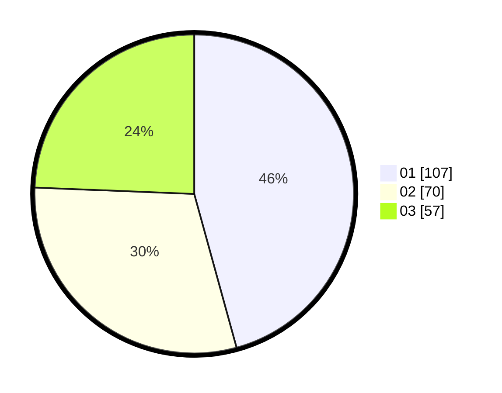

# Hasil

Hasil perolehan suara paslon dapat dilihat pada file paslon-01.txt, paslon-02.txt, dan paslon-03.txt.

Jika tidak ada, artinya data tersebut belum ada pada SIREKAP.

## Perolehan Suara

 * Paslon 01: **107**.
 * Paslon 02: **70**.
 * Paslon 03: **57**.

## Foto C Plano

https://sirekap-obj-formc.kpu.go.id/d374/pemilu/ppwp/31/74/04/10/02/3174041002126-20240215-205608--8103c18c-9306-493c-94ab-29bd2c716d74.jpg

https://sirekap-obj-formc.kpu.go.id/d374/pemilu/ppwp/31/74/04/10/02/3174041002126-20240215-205611--9e99cefc-351b-4c4e-81d8-67edcda9b83b.jpg

https://sirekap-obj-formc.kpu.go.id/d374/pemilu/ppwp/31/74/04/10/02/3174041002126-20240215-205609--a9cc759b-b260-447b-af6d-757733e36157.jpg

## DATA PEMILIH TETAP

Jumlah pemilih dalam DPT: **0**.
 * L: **0**.
 * P: **0**.

## DATA PENGGUNA HAK PILIH

Jumlah pengguna hak pilih dalam DPT: **0**.
 * L: **0**.
 * P: **0**.

Jumlah pengguna hak pilih dalam DPTb: **0**.
 * L: **0**.
 * P: **0**.

Jumlah pengguna hak pilih dalam DPK: **0**.
 * L: **0**.
 * P: **0**.

Jumlah pengguna hak pilih: **0**.
 * L: **0**.
 * P: **0**.

## JUMLAH SUARA SAH DAN TIDAK SAH

JUMLAH SELURUH SUARA SAH: **234**.

JUMLAH SUARA TIDAK SAH: **1**.

JUMLAH SELURUH SUARA SAH DAN SUARA TIDAK SAH: **235**.
