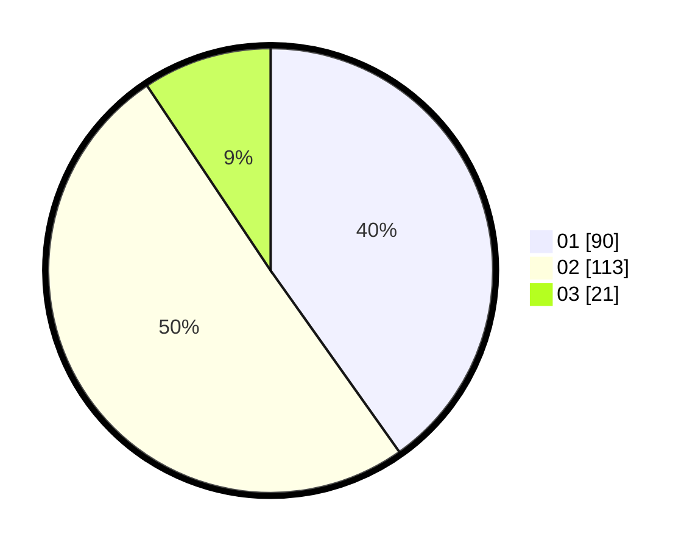

# Hasil

Hasil perolehan suara paslon dapat dilihat pada file paslon-01.txt, paslon-02.txt, dan paslon-03.txt.

Jika tidak ada, artinya data tersebut belum ada pada SIREKAP.

## Perolehan Suara

 * Paslon 01: **90**.
 * Paslon 02: **113**.
 * Paslon 03: **21**.

## Foto C Plano

https://sirekap-obj-formc.kpu.go.id/15e2/pemilu/ppwp/31/74/04/10/03/3174041003009-20240215-034703--64b6341c-390f-4bff-9738-c1cac1d13fd7.jpg

https://sirekap-obj-formc.kpu.go.id/15e2/pemilu/ppwp/31/74/04/10/03/3174041003009-20240215-034856--ba4281bf-0118-4221-9b22-da151dc9d65a.jpg

https://sirekap-obj-formc.kpu.go.id/15e2/pemilu/ppwp/31/74/04/10/03/3174041003009-20240215-033045--589deabd-e5e1-4cce-92cc-a564bb30dd9c.jpg
