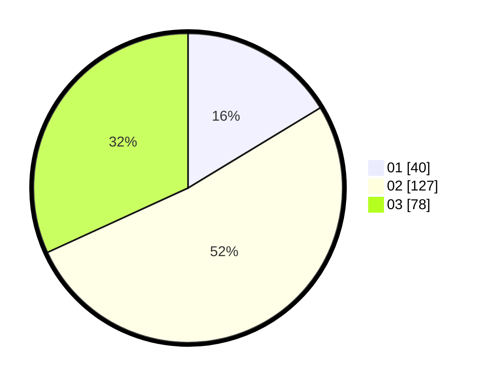

# Hasil

Hasil perolehan suara paslon dapat dilihat pada file paslon-01.txt, paslon-02.txt, dan paslon-03.txt.

Jika tidak ada, artinya data tersebut belum ada pada SIREKAP.

## Perolehan Suara

 * Paslon 01: **40**.
 * Paslon 02: **127**.
 * Paslon 03: **78**.

## Foto C Plano

https://sirekap-obj-formc.kpu.go.id/c757/pemilu/ppwp/31/74/04/10/03/3174041003010-20240214-200144--f3723cf7-9141-4b33-94a3-01db81d2b953.jpg

https://sirekap-obj-formc.kpu.go.id/c757/pemilu/ppwp/31/74/04/10/03/3174041003010-20240214-200445--05148c88-390e-4eec-b48b-832f31202b18.jpg

https://sirekap-obj-formc.kpu.go.id/c757/pemilu/ppwp/31/74/04/10/03/3174041003010-20240214-201943--a0f186bd-ad76-4939-8a23-995184bf6d97.jpg

## DATA PEMILIH TETAP

Jumlah pemilih dalam DPT: **242**.
 * L: **116**.
 * P: **126**.

## DATA PENGGUNA HAK PILIH

Jumlah pengguna hak pilih dalam DPT: **193**.
 * L: **88**.
 * P: **105**.

Jumlah pengguna hak pilih dalam DPTb: **10**.
 * L: **8**.
 * P: **2**.

Jumlah pengguna hak pilih dalam DPK: **2**.
 * L: **0**.
 * P: **2**.

Jumlah pengguna hak pilih: **205**.
 * L: **96**.
 * P: **109**.

## JUMLAH SUARA SAH DAN TIDAK SAH

JUMLAH SELURUH SUARA SAH: **201**.

JUMLAH SUARA TIDAK SAH: **4**.

JUMLAH SELURUH SUARA SAH DAN SUARA TIDAK SAH: **205**.
