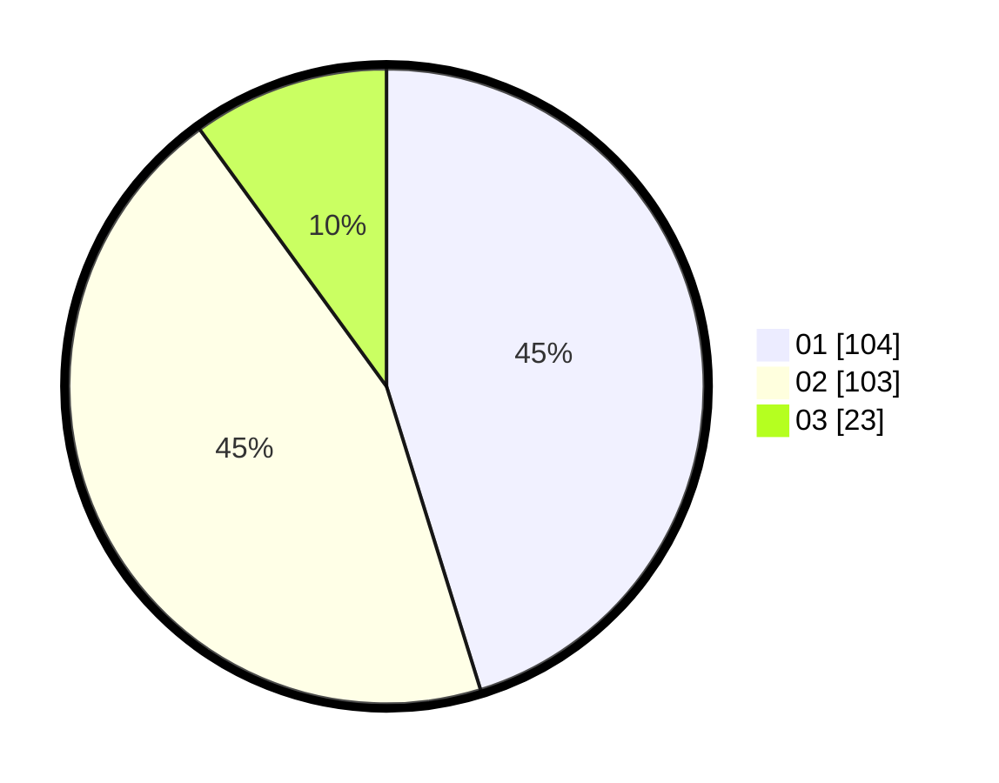

# Hasil

Hasil perolehan suara paslon dapat dilihat pada file paslon-01.txt, paslon-02.txt, dan paslon-03.txt.

Jika tidak ada, artinya data tersebut belum ada pada SIREKAP.

## Perolehan Suara

 * Paslon 01: **104**.
 * Paslon 02: **103**.
 * Paslon 03: **23**.

## Foto C Plano

https://sirekap-obj-formc.kpu.go.id/380e/pemilu/ppwp/31/74/04/10/03/3174041003014-20240214-155253--2892a047-f2a7-4b76-8315-7c6f39f304ce.jpg

https://sirekap-obj-formc.kpu.go.id/380e/pemilu/ppwp/31/74/04/10/03/3174041003014-20240214-185153--64be8de8-e339-4fbe-a2f8-2186981bc06a.jpg

https://sirekap-obj-formc.kpu.go.id/380e/pemilu/ppwp/31/74/04/10/03/3174041003014-20240214-155633--3ffbb000-c4d1-45c9-8446-4ef5b01dffa9.jpg

## DATA PEMILIH TETAP

Jumlah pemilih dalam DPT: **276**.
 * L: **135**.
 * P: **141**.

## DATA PENGGUNA HAK PILIH

Jumlah pengguna hak pilih dalam DPT: **218**.
 * L: **110**.
 * P: **108**.

Jumlah pengguna hak pilih dalam DPTb: **15**.
 * L: **5**.
 * P: **10**.

Jumlah pengguna hak pilih dalam DPK: **0**.
 * L: **0**.
 * P: **0**.

Jumlah pengguna hak pilih: **233**.
 * L: **115**.
 * P: **118**.

## JUMLAH SUARA SAH DAN TIDAK SAH

JUMLAH SELURUH SUARA SAH: **230**.

JUMLAH SUARA TIDAK SAH: **3**.

JUMLAH SELURUH SUARA SAH DAN SUARA TIDAK SAH: **233**.
