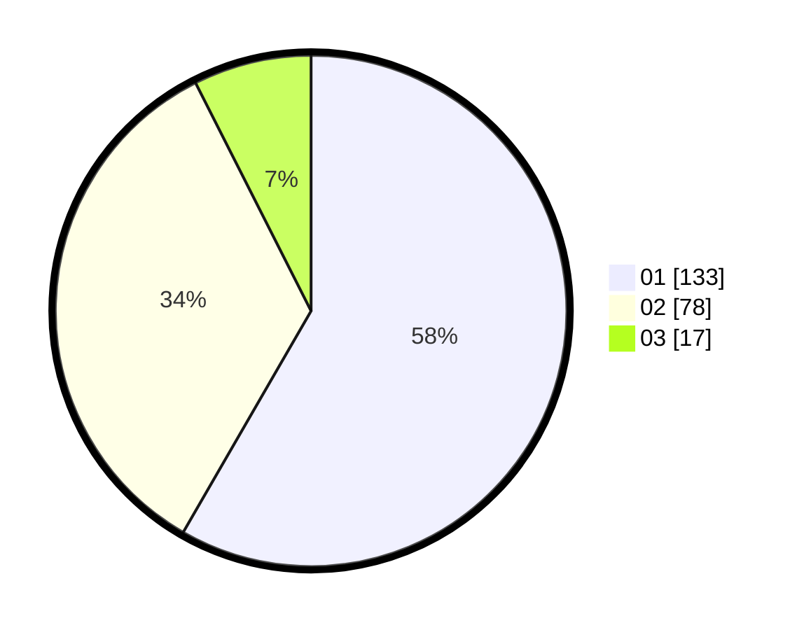

# Hasil

Hasil perolehan suara paslon dapat dilihat pada file paslon-01.txt, paslon-02.txt, dan paslon-03.txt.

Jika tidak ada, artinya data tersebut belum ada pada SIREKAP.

## Perolehan Suara

 * Paslon 01: **133**.
 * Paslon 02: **78**.
 * Paslon 03: **17**.

## Foto C Plano

https://sirekap-obj-formc.kpu.go.id/9657/pemilu/ppwp/31/74/04/10/03/3174041003021-20240214-184832--d7f975c5-8bdd-4068-b9bd-ceb018061b84.jpg

https://sirekap-obj-formc.kpu.go.id/9657/pemilu/ppwp/31/74/04/10/03/3174041003021-20240214-184851--1e1c4f45-128d-42c4-b15a-b2e2604533e7.jpg

https://sirekap-obj-formc.kpu.go.id/9657/pemilu/ppwp/31/74/04/10/03/3174041003021-20240214-184907--c01c8170-3c1e-4558-b722-ec532692b001.jpg

## DATA PEMILIH TETAP

Jumlah pemilih dalam DPT: **266**.
 * L: **122**.
 * P: **144**.

## DATA PENGGUNA HAK PILIH

Jumlah pengguna hak pilih dalam DPT: **219**.
 * L: **96**.
 * P: **123**.

Jumlah pengguna hak pilih dalam DPTb: **12**.
 * L: **7**.
 * P: **5**.

Jumlah pengguna hak pilih dalam DPK: **7**.
 * L: **0**.
 * P: **7**.

Jumlah pengguna hak pilih: **232**.
 * L: **104**.
 * P: **129**.

## JUMLAH SUARA SAH DAN TIDAK SAH

JUMLAH SELURUH SUARA SAH: **228**.

JUMLAH SUARA TIDAK SAH: **4**.

JUMLAH SELURUH SUARA SAH DAN SUARA TIDAK SAH: **232**.
